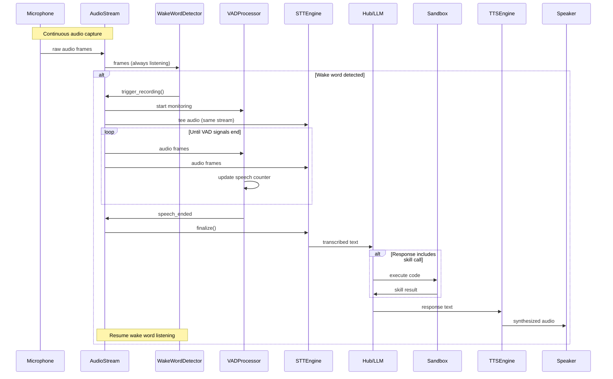
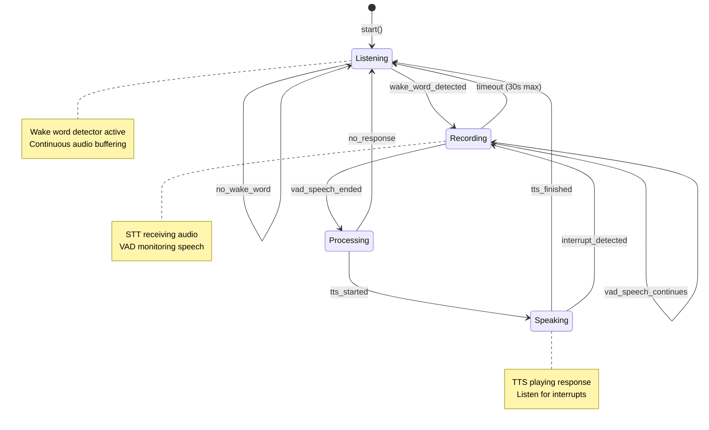
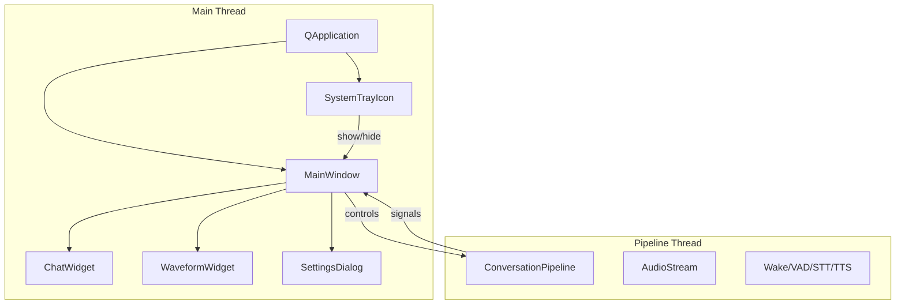
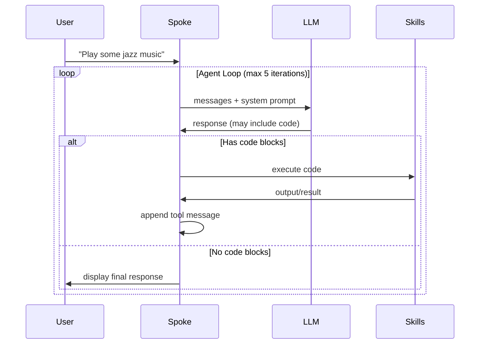

# Strawberry AI — Implementation Plan

This document details the technical implementation of the Spoke application, focusing on the voice interaction pipeline and modular architecture.

---

## Table of Contents

1. [Architecture Overview](#architecture-overview)
2. [Project Structure](#project-structure)
3. [Module Specifications](#module-specifications)
   - [Audio I/O](#audio-io)
   - [Wake Word Detection](#wake-word-detection)
   - [Voice Activity Detection (VAD)](#voice-activity-detection-vad)
   - [Speech-to-Text (STT)](#speech-to-text-stt)
   - [Text-to-Speech (TTS)](#text-to-speech-tts)
4. [Single Stream Architecture](#single-stream-architecture)
5. [VAD Algorithm](#vad-algorithm)
6. [Conversation Pipeline](#conversation-pipeline)
7. [UI Architecture](#ui-architecture)
8. [Configuration System](#configuration-system)
9. [Development Phases](#development-phases)

---

## Architecture Overview

```
┌─────────────────────────────────────────────────────────────────────────────┐
│                            SPOKE APPLICATION                                 │
│                                                                             │
│  ┌─────────────────────────────────────────────────────────────────────┐   │
│  │                        CONVERSATION PIPELINE                         │   │
│  │                                                                      │   │
│  │   ┌──────────┐    ┌──────────┐    ┌──────────┐    ┌──────────┐     │   │
│  │   │  Audio   │───▶│   Wake   │───▶│   STT    │───▶│   Hub    │     │   │
│  │   │  Stream  │    │   Word   │    │          │    │  Client  │     │   │
│  │   └──────────┘    └──────────┘    └──────────┘    └────┬─────┘     │   │
│  │        ▲                               ▲               │           │   │
│  │        │                               │               ▼           │   │
│  │   ┌────┴─────┐                    ┌────┴─────┐    ┌──────────┐     │   │
│  │   │   VAD    │                    │  Buffer  │    │   TTS    │     │   │
│  │   │          │                    │  Router  │    │          │     │   │
│  │   └──────────┘                    └──────────┘    └──────────┘     │   │
│  │                                                                      │   │
│  └─────────────────────────────────────────────────────────────────────┘   │
│                                                                             │
│  ┌─────────────────────┐  ┌─────────────────────┐  ┌───────────────────┐   │
│  │    Skill Runner     │  │   TensorZero        │  │      UI Layer     │   │
│  │    (Sandbox)        │  │   (Embedded)        │  │    (PySide6)      │   │
│  └─────────────────────┘  └─────────────────────┘  └───────────────────┘   │
│                                                                             │
└─────────────────────────────────────────────────────────────────────────────┘
```

### High-Level Data Flow



---

## Project Structure

```
ai-pc-spoke/
├── pyproject.toml              # Project metadata, dependencies
├── .env.example                # Template for API keys
├── config/
│   ├── tensorzero.toml         # TensorZero configuration
│   └── config.yaml             # Spoke settings
│
├── src/
│   └── strawberry/
│       ├── __init__.py
│       ├── main.py             # Entry point
│       ├── app.py              # Application orchestration
│       │
│       ├── audio/              # Audio I/O module
│       │   ├── __init__.py
│       │   ├── base.py         # Abstract interfaces
│       │   ├── stream.py       # AudioStream manager
│       │   └── backends/
│       │       ├── __init__.py
│       │       ├── sounddevice.py
│       │       └── pvrecorder.py
│       │
│       ├── wake/               # Wake word module
│       │   ├── __init__.py
│       │   ├── base.py         # Abstract interface
│       │   └── backends/
│       │       ├── __init__.py
│       │       └── porcupine.py
│       │
│       ├── vad/                # Voice Activity Detection
│       │   ├── __init__.py
│       │   ├── base.py         # Abstract interface
│       │   ├── processor.py    # VAD algorithm implementation
│       │   └── backends/
│       │       ├── __init__.py
│       │       ├── silero.py
│       │       └── cobra.py
│       │
│       ├── stt/                # Speech-to-Text
│       │   ├── __init__.py
│       │   ├── base.py         # Abstract interface
│       │   └── backends/
│       │       ├── __init__.py
│       │       ├── google.py
│       │       └── leopard.py
│       │
│       ├── tts/                # Text-to-Speech
│       │   ├── __init__.py
│       │   ├── base.py         # Abstract interface
│       │   └── backends/
│       │       ├── __init__.py
│       │       ├── google.py
│       │       └── orca.py
│       │
│       ├── pipeline/           # Conversation orchestration
│       │   ├── __init__.py
│       │   ├── conversation.py # Main pipeline controller
│       │   └── buffer.py       # Audio buffer/router
│       │
│       ├── hub/                # Hub communication
│       │   ├── __init__.py
│       │   ├── client.py       # TensorZero client wrapper
│       │   └── session.py      # Session management
│       │
│       ├── skills/             # Skill runner
│       │   ├── __init__.py
│       │   ├── loader.py       # Load skills from files
│       │   ├── registry.py     # Skill registration
│       │   └── sandbox.py      # Deno/Pyodide interface
│       │
│       ├── ui/                 # User interface
│       │   ├── __init__.py
│       │   ├── app.py          # PySide6 application
│       │   ├── main_window.py  # Main chat window
│       │   ├── tray.py         # System tray
│       │   ├── settings.py     # Settings dialog
│       │   └── widgets/
│       │       ├── __init__.py
│       │       ├── chat.py     # Chat widget
│       │       └── waveform.py # Audio visualization
│       │
│       └── config/             # Configuration management
│           ├── __init__.py
│           ├── settings.py     # Settings model
│           └── loader.py       # Config file loader
│
├── skills/                     # User skill files
│   └── example_skill.py
│
└── tests/
    ├── __init__.py
    ├── test_audio.py
    ├── test_vad.py
    └── test_pipeline.py
```

---

## Module Specifications

### Audio I/O

The audio module provides a unified interface for microphone input with pluggable backends.

#### Abstract Interface

```python
# src/strawberry/audio/base.py

from abc import ABC, abstractmethod
from typing import Callable, Iterator
import numpy as np

class AudioBackend(ABC):
    """Abstract base class for audio input backends."""
    
    @abstractmethod
    def __init__(self, sample_rate: int = 16000, frame_length_ms: int = 30):
        """Initialize the audio backend.
        
        Args:
            sample_rate: Audio sample rate in Hz (default 16000 for most STT)
            frame_length_ms: Length of each audio frame in milliseconds
        """
        pass
    
    @abstractmethod
    def start(self) -> None:
        """Start the audio stream."""
        pass
    
    @abstractmethod
    def stop(self) -> None:
        """Stop the audio stream."""
        pass
    
    @abstractmethod
    def read_frame(self) -> np.ndarray:
        """Read a single audio frame.
        
        Returns:
            numpy array of audio samples (int16)
        """
        pass
    
    @abstractmethod
    def frames(self) -> Iterator[np.ndarray]:
        """Yield audio frames continuously.
        
        Yields:
            numpy arrays of audio samples
        """
        pass
    
    @property
    @abstractmethod
    def is_active(self) -> bool:
        """Check if stream is currently active."""
        pass
    
    @property
    def frame_length(self) -> int:
        """Number of samples per frame."""
        return int(self.sample_rate * self.frame_length_ms / 1000)
```

#### Stream Manager

```python
# src/strawberry/audio/stream.py

from typing import Callable, List
from .base import AudioBackend
import numpy as np
from collections import deque
import threading

class AudioStream:
    """Manages a single continuous audio stream with multiple consumers."""
    
    def __init__(self, backend: AudioBackend):
        self.backend = backend
        self._subscribers: List[Callable[[np.ndarray], None]] = []
        self._buffer = deque(maxlen=100)  # Rolling buffer for lookback
        self._running = False
        self._thread = None
    
    def subscribe(self, callback: Callable[[np.ndarray], None]) -> None:
        """Add a subscriber to receive audio frames."""
        self._subscribers.append(callback)
    
    def unsubscribe(self, callback: Callable[[np.ndarray], None]) -> None:
        """Remove a subscriber."""
        self._subscribers.remove(callback)
    
    def get_buffer(self, frames: int) -> np.ndarray:
        """Get the last N frames from the buffer (for STT lookback)."""
        return np.concatenate(list(self._buffer)[-frames:])
    
    def start(self) -> None:
        """Start streaming audio to all subscribers."""
        self._running = True
        self.backend.start()
        self._thread = threading.Thread(target=self._stream_loop, daemon=True)
        self._thread.start()
    
    def stop(self) -> None:
        """Stop the audio stream."""
        self._running = False
        self.backend.stop()
        if self._thread:
            self._thread.join(timeout=1.0)
    
    def _stream_loop(self) -> None:
        """Main streaming loop - distributes frames to subscribers."""
        for frame in self.backend.frames():
            if not self._running:
                break
            
            self._buffer.append(frame)
            
            for subscriber in self._subscribers:
                subscriber(frame)
```

#### Backend: sounddevice

```python
# src/strawberry/audio/backends/sounddevice.py

import sounddevice as sd
import numpy as np
from typing import Iterator
from ..base import AudioBackend

class SoundDeviceBackend(AudioBackend):
    """Audio backend using sounddevice library."""
    
    def __init__(self, sample_rate: int = 16000, frame_length_ms: int = 30):
        self.sample_rate = sample_rate
        self.frame_length_ms = frame_length_ms
        self._stream = None
        self._queue = None
    
    def start(self) -> None:
        import queue
        self._queue = queue.Queue()
        self._stream = sd.InputStream(
            samplerate=self.sample_rate,
            channels=1,
            dtype='int16',
            blocksize=self.frame_length,
            callback=self._callback
        )
        self._stream.start()
    
    def stop(self) -> None:
        if self._stream:
            self._stream.stop()
            self._stream.close()
            self._stream = None
    
    def _callback(self, indata, frames, time, status):
        if status:
            print(f"Audio status: {status}")
        self._queue.put(indata.copy().flatten())
    
    def read_frame(self) -> np.ndarray:
        return self._queue.get()
    
    def frames(self) -> Iterator[np.ndarray]:
        while self._stream and self._stream.active:
            yield self.read_frame()
    
    @property
    def is_active(self) -> bool:
        return self._stream is not None and self._stream.active
```

---

### Wake Word Detection

#### Abstract Interface

```python
# src/strawberry/wake/base.py

from abc import ABC, abstractmethod
from typing import Callable, List
import numpy as np

class WakeWordDetector(ABC):
    """Abstract base class for wake word detection."""
    
    @abstractmethod
    def __init__(self, keywords: List[str], sensitivity: float = 0.5):
        """Initialize the wake word detector.
        
        Args:
            keywords: List of wake words to detect
            sensitivity: Detection sensitivity (0.0 to 1.0)
        """
        pass
    
    @abstractmethod
    def process(self, audio_frame: np.ndarray) -> int:
        """Process an audio frame for wake word detection.
        
        Args:
            audio_frame: Audio samples (int16)
            
        Returns:
            Index of detected keyword, or -1 if none detected
        """
        pass
    
    @abstractmethod
    def cleanup(self) -> None:
        """Release resources."""
        pass
```

#### Backend: Porcupine

```python
# src/strawberry/wake/backends/porcupine.py

import pvporcupine
import numpy as np
from typing import List
from ..base import WakeWordDetector

class PorcupineDetector(WakeWordDetector):
    """Wake word detection using Picovoice Porcupine."""
    
    def __init__(
        self, 
        keywords: List[str], 
        sensitivity: float = 0.5,
        access_key: str = None
    ):
        self.keywords = keywords
        self.sensitivity = sensitivity
        
        # Built-in keywords or custom .ppn files
        self._porcupine = pvporcupine.create(
            access_key=access_key,
            keywords=keywords,
            sensitivities=[sensitivity] * len(keywords)
        )
        
        self.frame_length = self._porcupine.frame_length
        self.sample_rate = self._porcupine.sample_rate
    
    def process(self, audio_frame: np.ndarray) -> int:
        """Process audio frame, return keyword index or -1."""
        return self._porcupine.process(audio_frame)
    
    def cleanup(self) -> None:
        if self._porcupine:
            self._porcupine.delete()
            self._porcupine = None
```

---

### Voice Activity Detection (VAD)

#### Abstract Interface

```python
# src/strawberry/vad/base.py

from abc import ABC, abstractmethod
import numpy as np

class VADBackend(ABC):
    """Abstract base class for Voice Activity Detection."""
    
    @abstractmethod
    def __init__(self, sample_rate: int = 16000):
        pass
    
    @abstractmethod
    def is_speech(self, audio_frame: np.ndarray) -> bool:
        """Determine if audio frame contains speech.
        
        Args:
            audio_frame: Audio samples
            
        Returns:
            True if speech detected, False otherwise
        """
        pass
    
    @abstractmethod
    def get_probability(self, audio_frame: np.ndarray) -> float:
        """Get speech probability for audio frame.
        
        Args:
            audio_frame: Audio samples
            
        Returns:
            Probability of speech (0.0 to 1.0)
        """
        pass
```

#### Backend: Silero

```python
# src/strawberry/vad/backends/silero.py

import torch
import numpy as np
from ..base import VADBackend

class SileroVAD(VADBackend):
    """VAD using Silero model (runs locally, no API key needed)."""
    
    def __init__(self, sample_rate: int = 16000, threshold: float = 0.5):
        self.sample_rate = sample_rate
        self.threshold = threshold
        
        # Load Silero VAD model
        self.model, utils = torch.hub.load(
            repo_or_dir='snakers4/silero-vad',
            model='silero_vad',
            force_reload=False
        )
        self.model.eval()
        
    def is_speech(self, audio_frame: np.ndarray) -> bool:
        return self.get_probability(audio_frame) >= self.threshold
    
    def get_probability(self, audio_frame: np.ndarray) -> float:
        # Convert to float32 and normalize
        audio = audio_frame.astype(np.float32) / 32768.0
        tensor = torch.from_numpy(audio)
        
        with torch.no_grad():
            prob = self.model(tensor, self.sample_rate).item()
        
        return prob
```

#### Backend: Cobra (Picovoice)

```python
# src/strawberry/vad/backends/cobra.py

import pvcobra
import numpy as np
from ..base import VADBackend

class CobraVAD(VADBackend):
    """VAD using Picovoice Cobra."""
    
    def __init__(self, sample_rate: int = 16000, access_key: str = None):
        self.sample_rate = sample_rate
        self._cobra = pvcobra.create(access_key=access_key)
        self.frame_length = self._cobra.frame_length
        
    def is_speech(self, audio_frame: np.ndarray) -> bool:
        return self.get_probability(audio_frame) >= 0.5
    
    def get_probability(self, audio_frame: np.ndarray) -> float:
        return self._cobra.process(audio_frame)
    
    def cleanup(self) -> None:
        if self._cobra:
            self._cobra.delete()
```

---

### Speech-to-Text (STT)

#### Abstract Interface

```python
# src/strawberry/stt/base.py

from abc import ABC, abstractmethod
from typing import AsyncIterator, Optional
from dataclasses import dataclass
import numpy as np

@dataclass
class TranscriptionResult:
    """Result from STT processing."""
    text: str
    confidence: float
    is_final: bool
    language: Optional[str] = None

class STTEngine(ABC):
    """Abstract base class for Speech-to-Text engines."""
    
    @abstractmethod
    async def transcribe(self, audio: np.ndarray) -> TranscriptionResult:
        """Transcribe complete audio buffer.
        
        Args:
            audio: Complete audio buffer (int16)
            
        Returns:
            Transcription result
        """
        pass
    
    @abstractmethod
    async def transcribe_stream(
        self, 
        audio_stream: AsyncIterator[np.ndarray]
    ) -> AsyncIterator[TranscriptionResult]:
        """Transcribe streaming audio with interim results.
        
        Args:
            audio_stream: Async iterator of audio frames
            
        Yields:
            Interim and final transcription results
        """
        pass
```

#### Backend: Google Cloud STT

```python
# src/strawberry/stt/backends/google.py

from google.cloud import speech_v1 as speech
import numpy as np
from typing import AsyncIterator
from ..base import STTEngine, TranscriptionResult

class GoogleSTT(STTEngine):
    """Speech-to-Text using Google Cloud Speech API."""
    
    def __init__(self, language_code: str = "en-US", sample_rate: int = 16000):
        self.language_code = language_code
        self.sample_rate = sample_rate
        self.client = speech.SpeechClient()
        
        self.config = speech.RecognitionConfig(
            encoding=speech.RecognitionConfig.AudioEncoding.LINEAR16,
            sample_rate_hertz=sample_rate,
            language_code=language_code,
            enable_automatic_punctuation=True,
        )
        
        self.streaming_config = speech.StreamingRecognitionConfig(
            config=self.config,
            interim_results=True,
        )
    
    async def transcribe(self, audio: np.ndarray) -> TranscriptionResult:
        audio_bytes = audio.tobytes()
        audio_content = speech.RecognitionAudio(content=audio_bytes)
        
        response = self.client.recognize(config=self.config, audio=audio_content)
        
        if response.results:
            result = response.results[0]
            return TranscriptionResult(
                text=result.alternatives[0].transcript,
                confidence=result.alternatives[0].confidence,
                is_final=True,
            )
        
        return TranscriptionResult(text="", confidence=0.0, is_final=True)
    
    async def transcribe_stream(
        self, 
        audio_stream: AsyncIterator[np.ndarray]
    ) -> AsyncIterator[TranscriptionResult]:
        # Implementation for streaming recognition
        def request_generator():
            yield speech.StreamingRecognizeRequest(
                streaming_config=self.streaming_config
            )
            async for frame in audio_stream:
                yield speech.StreamingRecognizeRequest(
                    audio_content=frame.tobytes()
                )
        
        responses = self.client.streaming_recognize(request_generator())
        
        for response in responses:
            for result in response.results:
                yield TranscriptionResult(
                    text=result.alternatives[0].transcript,
                    confidence=result.alternatives[0].confidence if result.is_final else 0.0,
                    is_final=result.is_final,
                )
```

#### Backend: Leopard (Picovoice)

```python
# src/strawberry/stt/backends/leopard.py

import pvleopard
import numpy as np
from ..base import STTEngine, TranscriptionResult

class LeopardSTT(STTEngine):
    """Speech-to-Text using Picovoice Leopard (offline)."""
    
    def __init__(self, access_key: str = None):
        self._leopard = pvleopard.create(access_key=access_key)
        self.sample_rate = self._leopard.sample_rate
    
    async def transcribe(self, audio: np.ndarray) -> TranscriptionResult:
        transcript, words = self._leopard.process(audio)
        
        # Calculate average confidence from word confidences
        confidence = sum(w.confidence for w in words) / len(words) if words else 0.0
        
        return TranscriptionResult(
            text=transcript,
            confidence=confidence,
            is_final=True,
        )
    
    async def transcribe_stream(self, audio_stream):
        # Leopard doesn't support streaming, buffer and process at end
        frames = []
        async for frame in audio_stream:
            frames.append(frame)
        
        audio = np.concatenate(frames)
        result = await self.transcribe(audio)
        yield result
    
    def cleanup(self) -> None:
        if self._leopard:
            self._leopard.delete()
```

---

### Text-to-Speech (TTS)

#### Abstract Interface

```python
# src/strawberry/tts/base.py

from abc import ABC, abstractmethod
from typing import AsyncIterator
from dataclasses import dataclass
import numpy as np

@dataclass
class AudioChunk:
    """Chunk of synthesized audio."""
    audio: np.ndarray
    sample_rate: int

class TTSEngine(ABC):
    """Abstract base class for Text-to-Speech engines."""
    
    @abstractmethod
    async def synthesize(self, text: str) -> AudioChunk:
        """Synthesize complete text to audio.
        
        Args:
            text: Text to synthesize
            
        Returns:
            Complete audio chunk
        """
        pass
    
    @abstractmethod
    async def synthesize_stream(self, text: str) -> AsyncIterator[AudioChunk]:
        """Synthesize text with streaming output.
        
        Args:
            text: Text to synthesize
            
        Yields:
            Audio chunks as they're generated
        """
        pass
```

#### Backend: Orca (Picovoice)

```python
# src/strawberry/tts/backends/orca.py

import pvorca
import numpy as np
from typing import AsyncIterator
from ..base import TTSEngine, AudioChunk

class OrcaTTS(TTSEngine):
    """Text-to-Speech using Picovoice Orca (offline streaming)."""
    
    def __init__(self, access_key: str = None):
        self._orca = pvorca.create(access_key=access_key)
        self.sample_rate = self._orca.sample_rate
    
    async def synthesize(self, text: str) -> AudioChunk:
        audio, _ = self._orca.synthesize(text)
        return AudioChunk(
            audio=np.array(audio, dtype=np.int16),
            sample_rate=self.sample_rate
        )
    
    async def synthesize_stream(self, text: str) -> AsyncIterator[AudioChunk]:
        stream = self._orca.stream_open()
        
        try:
            for chunk in self._orca.synthesize_stream(stream, text):
                if chunk is not None:
                    yield AudioChunk(
                        audio=np.array(chunk, dtype=np.int16),
                        sample_rate=self.sample_rate
                    )
            
            # Flush remaining audio
            final_chunk = self._orca.stream_flush(stream)
            if final_chunk:
                yield AudioChunk(
                    audio=np.array(final_chunk, dtype=np.int16),
                    sample_rate=self.sample_rate
                )
        finally:
            self._orca.stream_close(stream)
    
    def cleanup(self) -> None:
        if self._orca:
            self._orca.delete()
```

---

## Single Stream Architecture

The key to avoiding audio "blips" is maintaining one continuous microphone stream that gets routed to different consumers.

```
┌─────────────────────────────────────────────────────────────────┐
│                     AUDIO STREAM MANAGER                        │
│                                                                 │
│  ┌─────────────┐                                               │
│  │ Microphone  │                                               │
│  │  Backend    │                                               │
│  └──────┬──────┘                                               │
│         │                                                       │
│         ▼                                                       │
│  ┌─────────────────────────────────────────────────────────┐   │
│  │              FRAME DISTRIBUTOR                           │   │
│  │  ┌─────────────────────────────────────────────────┐    │   │
│  │  │              Rolling Buffer (100 frames)         │    │   │
│  │  │     [f1][f2][f3][f4]...[f97][f98][f99][f100]    │    │   │
│  │  └─────────────────────────────────────────────────┘    │   │
│  │                          │                               │   │
│  │         ┌────────────────┼────────────────┐             │   │
│  │         ▼                ▼                ▼             │   │
│  │  ┌────────────┐  ┌────────────┐  ┌────────────┐        │   │
│  │  │ Wake Word  │  │    VAD     │  │    STT     │        │   │
│  │  │ (always)   │  │ (on-demand)│  │ (on-demand)│        │   │
│  │  └────────────┘  └────────────┘  └────────────┘        │   │
│  └─────────────────────────────────────────────────────────┘   │
│                                                                 │
└─────────────────────────────────────────────────────────────────┘
```

### State Machine



### Implementation

```python
# src/strawberry/pipeline/conversation.py

import asyncio
from enum import Enum, auto
from typing import Optional
from dataclasses import dataclass

from ..audio.stream import AudioStream
from ..wake.base import WakeWordDetector
from ..vad.processor import VADProcessor
from ..stt.base import STTEngine
from ..tts.base import TTSEngine
from ..hub.client import HubClient

class PipelineState(Enum):
    LISTENING = auto()    # Waiting for wake word
    RECORDING = auto()    # Capturing user speech
    PROCESSING = auto()   # Sending to Hub/LLM
    SPEAKING = auto()     # Playing TTS response
    PAUSED = auto()       # System paused

@dataclass
class PipelineConfig:
    max_recording_duration: float = 30.0  # Max seconds to record
    lookback_frames: int = 10             # Frames to include from before wake word
    interrupt_enabled: bool = True         # Allow user to interrupt TTS

class ConversationPipeline:
    """Orchestrates the full conversation flow."""
    
    def __init__(
        self,
        audio_stream: AudioStream,
        wake_detector: WakeWordDetector,
        vad_processor: VADProcessor,
        stt_engine: STTEngine,
        tts_engine: TTSEngine,
        hub_client: HubClient,
        config: PipelineConfig = None,
    ):
        self.audio_stream = audio_stream
        self.wake_detector = wake_detector
        self.vad_processor = vad_processor
        self.stt_engine = stt_engine
        self.tts_engine = tts_engine
        self.hub_client = hub_client
        self.config = config or PipelineConfig()
        
        self._state = PipelineState.LISTENING
        self._recording_buffer = []
        self._state_callbacks = []
        
    @property
    def state(self) -> PipelineState:
        return self._state
    
    def on_state_change(self, callback):
        """Register callback for state changes."""
        self._state_callbacks.append(callback)
    
    def _set_state(self, new_state: PipelineState):
        old_state = self._state
        self._state = new_state
        for callback in self._state_callbacks:
            callback(old_state, new_state)
    
    async def start(self):
        """Start the conversation pipeline."""
        self.audio_stream.subscribe(self._on_audio_frame)
        self.audio_stream.start()
        self._set_state(PipelineState.LISTENING)
    
    async def stop(self):
        """Stop the conversation pipeline."""
        self.audio_stream.stop()
        self._set_state(PipelineState.PAUSED)
    
    def _on_audio_frame(self, frame):
        """Handle incoming audio frame based on current state."""
        if self._state == PipelineState.LISTENING:
            self._handle_listening(frame)
        elif self._state == PipelineState.RECORDING:
            self._handle_recording(frame)
        elif self._state == PipelineState.SPEAKING:
            if self.config.interrupt_enabled:
                self._check_interrupt(frame)
    
    def _handle_listening(self, frame):
        """Process frame while waiting for wake word."""
        keyword_index = self.wake_detector.process(frame)
        
        if keyword_index >= 0:
            # Wake word detected! Start recording
            self._start_recording()
    
    def _start_recording(self):
        """Transition to recording state."""
        self._set_state(PipelineState.RECORDING)
        
        # Include lookback buffer (audio from before wake word)
        lookback = self.audio_stream.get_buffer(self.config.lookback_frames)
        self._recording_buffer = [lookback]
        
        # Reset VAD processor
        self.vad_processor.reset()
        
        # Start recording timeout
        asyncio.create_task(self._recording_timeout())
    
    def _handle_recording(self, frame):
        """Process frame while recording user speech."""
        self._recording_buffer.append(frame)
        
        # Update VAD
        speech_ended = self.vad_processor.process(frame)
        
        if speech_ended:
            self._finish_recording()
    
    def _finish_recording(self):
        """Transition from recording to processing."""
        self._set_state(PipelineState.PROCESSING)
        
        # Concatenate all recorded audio
        import numpy as np
        audio = np.concatenate(self._recording_buffer)
        self._recording_buffer = []
        
        # Process asynchronously
        asyncio.create_task(self._process_speech(audio))
    
    async def _process_speech(self, audio):
        """Transcribe and send to Hub."""
        # Transcribe
        result = await self.stt_engine.transcribe(audio)
        
        if not result.text.strip():
            # No speech detected
            self._set_state(PipelineState.LISTENING)
            return
        
        # Send to Hub
        response = await self.hub_client.send_message(result.text)
        
        # Speak response
        await self._speak_response(response.text)
    
    async def _speak_response(self, text: str):
        """Synthesize and play response."""
        self._set_state(PipelineState.SPEAKING)
        
        async for chunk in self.tts_engine.synthesize_stream(text):
            if self._state != PipelineState.SPEAKING:
                # Interrupted
                break
            await self._play_audio(chunk)
        
        self._set_state(PipelineState.LISTENING)
    
    async def _recording_timeout(self):
        """Force end recording after max duration."""
        await asyncio.sleep(self.config.max_recording_duration)
        if self._state == PipelineState.RECORDING:
            self._finish_recording()
    
    def _check_interrupt(self, frame):
        """Check if user is interrupting TTS playback."""
        # Could use wake word or just loud speech
        if self.vad_processor.vad.is_speech(frame):
            # User is speaking, interrupt TTS
            self._set_state(PipelineState.RECORDING)
            self._recording_buffer = [frame]
```

---

## VAD Algorithm

The weighted counter algorithm that rewards consistent speech and filters noise.

```python
# src/strawberry/vad/processor.py

from dataclasses import dataclass
from .base import VADBackend
import numpy as np

@dataclass
class VADConfig:
    """Configuration for VAD processor."""
    max_buffer: float = 2.0          # Hard cap on speech buffer
    initial_buffer: float = 1.5       # Start-up grace period
    base_decay: float = 1.0           # Rate of drainage during silence
    growth_rate: float = 2.0          # Refill speed during speech
    long_talk_threshold: float = 8.0  # Seconds before aggressive decay
    decay_multiplier_rate: float = 0.5  # How fast decay accelerates

class VADProcessor:
    """Voice Activity Detection with weighted counter algorithm.
    
    This algorithm:
    - Builds momentum during speech (fills buffer)
    - Filters short noise bursts
    - Gets more aggressive at closing for long sessions
    """
    
    def __init__(self, vad: VADBackend, config: VADConfig = None, frame_duration_ms: int = 30):
        self.vad = vad
        self.config = config or VADConfig()
        self.frame_duration = frame_duration_ms / 1000.0  # Convert to seconds
        
        self._counter = 0.0
        self._session_duration = 0.0
        self._is_recording = False
    
    def reset(self):
        """Reset for a new recording session."""
        self._counter = self.config.initial_buffer
        self._session_duration = 0.0
        self._is_recording = True
    
    def process(self, frame: np.ndarray) -> bool:
        """Process an audio frame.
        
        Args:
            frame: Audio samples
            
        Returns:
            True if speech has ended (stop recording), False otherwise
        """
        if not self._is_recording:
            return True
        
        is_speaking = self.vad.is_speech(frame)
        self._session_duration += self.frame_duration
        
        if is_speaking:
            # Refill buffer faster than it drains (reward speech)
            self._counter = min(
                self.config.max_buffer,
                self._counter + (self.frame_duration * self.config.growth_rate)
            )
        else:
            # Calculate decay multiplier (increases over time)
            time_over_threshold = max(
                0, 
                self._session_duration - self.config.long_talk_threshold
            )
            multiplier = 1.0 + (time_over_threshold * self.config.decay_multiplier_rate)
            
            # Drain the buffer
            self._counter -= (self.frame_duration * self.config.base_decay * multiplier)
        
        # Check if recording should end
        if self._counter <= 0:
            self._is_recording = False
            return True
        
        return False
    
    @property
    def counter(self) -> float:
        """Current buffer level (for debugging/visualization)."""
        return self._counter
    
    @property
    def session_duration(self) -> float:
        """How long the current recording has been running."""
        return self._session_duration
```

### Visualization of VAD Algorithm

```
Speech Counter Over Time
─────────────────────────────────────────────────────────────────

Buffer    │
Level     │      ┌──┐  ┌────────┐
(2.0 max) │      │  │  │        │        Speech detected
          │    ┌─┘  └──┘        │
(1.5)     │────┘                 └─────┐
          │                             │   Silence decay
(1.0)     │                              └──┐
          │                                  └─┐
(0.5)     │                                    └──┐  Accelerated
          │                                        └─ decay (long talk)
(0.0)     │─────────────────────────────────────────X─────────
          └──────────────────────────────────────────────────▶
          0s    2s    4s    6s    8s    10s   12s   14s   Time
                                  │
                                  └── Long talk threshold

Legend:
  ─── Buffer level
  X   Recording ends (buffer empty)
```

---

## Configuration System

### tensorzero.toml

```toml
# config/tensorzero.toml

[gateway]
# Embedded gateway - no separate service needed

[functions.chat]
type = "chat"

[functions.chat.variants.default]
type = "chat_completion"
model = "hub"  # Routes to Hub
system_template = "system_prompt.jinja"
user_template = "user_prompt.jinja"

[models.hub]
# Hub acts as LLM proxy
routing = ["hub_primary"]

[models.hub.providers.hub_primary]
type = "openai"  # Hub exposes OpenAI-compatible API
model_name = "gpt-4o"  # Hub handles actual model selection
```

### config.yaml

```yaml
# config/config.yaml

device:
  name: "Living Room Speaker"
  id: null  # Auto-generated if not set

hub:
  url: "http://localhost:8000"
  token: "${HUB_TOKEN}"  # From .env

audio:
  backend: "sounddevice"  # or "pvrecorder"
  sample_rate: 16000
  frame_length_ms: 30

wake_word:
  backend: "porcupine"
  keywords: ["jarvis", "hey strawberry"]
  sensitivity: 0.5

vad:
  backend: "silero"  # or "cobra"
  config:
    max_buffer: 2.0
    initial_buffer: 1.5
    base_decay: 1.0
    growth_rate: 2.0
    long_talk_threshold: 8.0

stt:
  backend: "google"  # or "leopard"
  language: "en-US"

tts:
  backend: "orca"  # or "google"
  voice: null  # Use default

skills:
  path: "./skills"
  
ui:
  theme: "dark"
  start_minimized: false
  show_waveform: true
```

### .env.example

```bash
# .env.example

# Hub authentication
HUB_TOKEN=your_hub_jwt_token_here

# Picovoice (for Porcupine, Leopard, Orca, Cobra)
PICOVOICE_ACCESS_KEY=your_picovoice_key_here

# Google Cloud (for Google STT/TTS)
GOOGLE_APPLICATION_CREDENTIALS=/path/to/service-account.json

# OpenAI (if using directly instead of through Hub)
OPENAI_API_KEY=your_openai_key_here
```

---

## UI Architecture

### PySide6 Application Structure



### Main Window Layout

```
┌─────────────────────────────────────────────────────────────┐
│  Strawberry AI                              [─] [□] [×]    │
├─────────────────────────────────────────────────────────────┤
│  ┌───────────────────────────────────────────────────────┐  │
│  │                                                       │  │
│  │  🤖 Hello! How can I help you today?                  │  │
│  │                                                       │  │
│  │  👤 Turn on the living room lights                    │  │
│  │                                                       │  │
│  │  🤖 I'll turn on the living room lights.              │  │
│  │     ┌──────────────────────────────────────────────┐  │  │
│  │     │ ⚙️ Skill Call: SmartHomeSkill.turn_on()      │  │  │
│  │     │    device: "Living Room Light"               │  │  │
│  │     │    ✅ Success                                 │  │  │
│  │     └──────────────────────────────────────────────┘  │  │
│  │     Done! The living room lights are now on.          │  │
│  │                                                       │  │
│  └───────────────────────────────────────────────────────┘  │
│                                                             │
│  ┌───────────────────────────────────────────────────────┐  │
│  │  ~~~~~~~~~~~~ Waveform / Status ~~~~~~~~~~~~          │  │
│  │  🎤 Listening for wake word...                        │  │
│  └───────────────────────────────────────────────────────┘  │
│                                                             │
│  ┌─────────────────────────────────────────────┐ [⚙️] [🎤] │
│  │ Type a message...                           │           │
│  └─────────────────────────────────────────────┘           │
└─────────────────────────────────────────────────────────────┘
```

### System Tray

```
┌────────────────────────────┐
│ 🍓 Strawberry AI           │
├────────────────────────────┤
│  🎤 Start Listening        │
│  ⏸️  Pause                  │
│  ──────────────────────    │
│  📊 Show Window            │
│  ⚙️  Settings              │
│  ──────────────────────    │
│  ❌ Quit                   │
└────────────────────────────┘
```

---

## Development Phases (Detailed)

### Phase 1A: Core Infrastructure (Week 1-2)

```
[ ] Project setup
    [ ] pyproject.toml with dependencies
    [ ] Directory structure
    [ ] .env.example
    
[ ] Configuration system
    [ ] Settings model (Pydantic)
    [ ] YAML loader
    [ ] Environment variable injection
    
[ ] Audio module
    [ ] Abstract interface
    [ ] sounddevice backend
    [ ] AudioStream manager
    [ ] Unit tests
```

### Phase 1B: Voice Pipeline (Week 3-4)

```
[ ] Wake word module
    [ ] Abstract interface
    [ ] Porcupine backend
    
[ ] VAD module
    [ ] Abstract interface
    [ ] Silero backend
    [ ] VAD processor (weighted counter)
    [ ] Unit tests
    
[ ] STT module
    [ ] Abstract interface
    [ ] Google STT backend
    
[ ] TTS module
    [ ] Abstract interface
    [ ] Orca backend
```

### Phase 1C: Integration (Week 5-6)

```
[ ] ConversationPipeline
    [ ] State machine
    [ ] Single stream routing
    [ ] Wake → Record → Process → Speak flow
    
[ ] Hub client
    [ ] TensorZero embedded gateway
    [ ] Session management
    
[ ] Terminal UI
    [ ] Print transcriptions
    [ ] Print responses
    [ ] Print skill calls
    [ ] Accept text input (fallback)
```

### Phase 2A: Desktop UI (Week 7-8)

```
[ ] PySide6 application
    [ ] MainWindow
    [ ] ChatWidget
    [ ] WaveformWidget
    [ ] SystemTrayIcon
    
[ ] Settings dialog
    [ ] Device configuration
    [ ] Audio backend selection
    [ ] STT/TTS selection
    
[ ] Thread integration
    [ ] Pipeline in background thread
    [ ] Qt signals for state updates
```

### Phase 2B: Hub Integration (Week 9-10)

```
[ ] Remote mode
    [ ] Skill registration
    [ ] MQTT connection
    [ ] Remote skill calls
    
[ ] Skill runner
    [ ] Sandbox (Deno + Pyodide)
    [ ] Proxy generation
    [ ] Gatekeeper validation
```

---

## Testing Strategy

### Unit Tests

```python
# tests/test_vad.py

import pytest
import numpy as np
from strawberry.vad.processor import VADProcessor, VADConfig

class MockVAD:
    def __init__(self, speech_frames):
        self.speech_frames = set(speech_frames)
        self.frame_count = 0
    
    def is_speech(self, frame):
        result = self.frame_count in self.speech_frames
        self.frame_count += 1
        return result

def test_vad_ends_on_silence():
    """VAD should end recording after sustained silence."""
    # No speech at all
    mock_vad = MockVAD(speech_frames=[])
    processor = VADProcessor(mock_vad, VADConfig(initial_buffer=0.5))
    processor.reset()
    
    frame = np.zeros(480, dtype=np.int16)
    
    # Process enough frames to drain buffer
    for _ in range(100):
        if processor.process(frame):
            break
    
    assert not processor._is_recording

def test_vad_continues_during_speech():
    """VAD should keep recording during continuous speech."""
    mock_vad = MockVAD(speech_frames=set(range(100)))
    processor = VADProcessor(mock_vad)
    processor.reset()
    
    frame = np.zeros(480, dtype=np.int16)
    
    # Process many frames with speech
    ended = False
    for _ in range(100):
        if processor.process(frame):
            ended = True
            break
    
    assert not ended
    assert processor._counter > 0
```

### Integration Tests

```python
# tests/test_pipeline.py

import pytest
import asyncio
from strawberry.pipeline.conversation import ConversationPipeline, PipelineState

@pytest.mark.asyncio
async def test_wake_word_triggers_recording(mock_pipeline):
    """Pipeline should transition to RECORDING after wake word."""
    pipeline = mock_pipeline
    await pipeline.start()
    
    assert pipeline.state == PipelineState.LISTENING
    
    # Simulate wake word
    pipeline.wake_detector.trigger()
    await asyncio.sleep(0.1)
    
    assert pipeline.state == PipelineState.RECORDING
```

---

## Dependencies

```toml
# pyproject.toml

[project]
name = "strawberry-spoke"
version = "0.1.0"
requires-python = ">=3.10"

dependencies = [
    # Core
    "tensorzero>=0.1.0",
    "pydantic>=2.0",
    "pyyaml>=6.0",
    "python-dotenv>=1.0",
    
    # Audio
    "sounddevice>=0.4",
    "numpy>=1.24",
    
    # Wake Word
    "pvporcupine>=3.0",
    
    # VAD
    "torch>=2.0",  # For Silero
    # "pvcobra>=2.0",  # Alternative
    
    # STT
    "google-cloud-speech>=2.0",
    # "pvleopard>=2.0",  # Alternative
    
    # TTS
    "pvorca>=1.0",
    # "google-cloud-texttospeech>=2.0",  # Alternative
    
    # UI
    "PySide6>=6.5",
    "qasync>=0.24",  # Qt + asyncio integration
]

[project.optional-dependencies]
dev = [
    "pytest>=7.0",
    "pytest-asyncio>=0.21",
    "pytest-cov>=4.0",
    "black>=23.0",
    "ruff>=0.1",
]
```

---

---

## Agent Loop Implementation

The Spoke implements an agent loop that allows the LLM to make multiple skill calls and see results before responding.

### Agent Flow



### Device Proxy with Discovery

```python
# src/strawberry/skills/service.py (additions)

class _DeviceProxy:
    """Proxy object for LLM to interact with skills."""
    
    def __init__(self, loader: SkillLoader):
        self._loader = loader
    
    def search_skills(self, query: str = "") -> List[dict]:
        """Search for skills by keyword.
        
        Args:
            query: Search term (matches name, signature, docstring)
            
        Returns:
            List of matching skills with path, signature, summary
        """
        results = []
        for skill in self._loader.get_all_skills():
            for method in skill.methods:
                # Check if query matches
                if (not query or
                    query.lower() in method.name.lower() or
                    query.lower() in skill.name.lower() or
                    (method.docstring and query.lower() in method.docstring.lower())):
                    
                    results.append({
                        "path": f"{skill.name}.{method.name}",
                        "signature": method.signature,
                        "summary": (method.docstring or "").split("\n")[0],
                    })
        return results
    
    def describe_function(self, path: str) -> str:
        """Get full function details.
        
        Args:
            path: "SkillName.method_name"
            
        Returns:
            Full signature with docstring
        """
        parts = path.split(".")
        if len(parts) != 2:
            return f"Invalid path: {path}"
        
        skill_name, method_name = parts
        skill = self._loader.get_skill(skill_name)
        
        if not skill:
            return f"Skill not found: {skill_name}"
        
        for method in skill.methods:
            if method.name == method_name:
                doc = method.docstring or "No description"
                return f"def {method.signature}:\n    \"\"\"{doc}\"\"\""
        
        return f"Method not found: {method_name}"
    
    def __getattr__(self, name: str):
        """Get skill class for direct calls."""
        skill = self._loader.get_skill(name)
        if skill is None:
            raise AttributeError(f"Skill not found: {name}")
        return _SkillProxy(self._loader, name)
```

### Agent Loop Implementation

```python
# In main_window.py or skill_service.py

async def run_agent_loop(
    hub_client: HubClient,
    skill_service: SkillService,
    user_message: str,
    conversation_history: List[ChatMessage],
    max_iterations: int = 5,
) -> Tuple[str, List[dict]]:
    """Run the agent loop until LLM responds without code.
    
    Args:
        hub_client: Hub client for LLM calls
        skill_service: Skill service for execution
        user_message: User's message
        conversation_history: Previous messages
        max_iterations: Max loop iterations
        
    Returns:
        (final_response, list_of_tool_calls)
    """
    # Build initial messages
    messages = [
        ChatMessage(role="system", content=skill_service.get_system_prompt()),
        *conversation_history,
        ChatMessage(role="user", content=user_message),
    ]
    
    all_tool_calls = []
    
    for iteration in range(max_iterations):
        # Get LLM response
        response = await hub_client.chat(messages)
        
        # Parse for code blocks
        code_blocks = skill_service.parse_skill_calls(response.content)
        
        if not code_blocks:
            # No code = agent is done
            return response.content, all_tool_calls
        
        # Execute code blocks and collect results
        outputs = []
        for code in code_blocks:
            result = skill_service.execute_code(code)
            
            all_tool_calls.append({
                "iteration": iteration + 1,
                "code": code,
                "success": result.success,
                "result": result.result,
                "error": result.error,
            })
            
            if result.success:
                outputs.append(result.result or "")
            else:
                outputs.append(f"Error: {result.error}")
        
        # Add assistant message and tool results to history
        messages.append(ChatMessage(role="assistant", content=response.content))
        messages.append(ChatMessage(role="tool", content="\n".join(outputs)))
    
    # Max iterations reached - return last response
    return response.content, all_tool_calls
```

### Updated System Prompt

```python
SYSTEM_PROMPT = '''You are Strawberry, a helpful AI assistant with access to skills on this device.

## How to Use Skills

You can discover and call skills using Python code blocks:

```python
# Search for skills by keyword
results = device.search_skills("lights")
print(results)
```

```python
# Get details about a specific function  
info = device.describe_function("SmartHomeSkill.turn_on")
print(info)
```

```python
# Call a skill
result = device.SmartHomeSkill.turn_on(room="Living Room")
print(result)
```

## Workflow

1. If you're not sure what skills are available, search first
2. Use describe_function() to see full signatures and parameters
3. Call the skill with appropriate arguments
4. Always use print() to see output
5. When done, respond naturally without code blocks

## Important

- Search before calling if you don't know the exact skill name
- Handle errors gracefully - explain to user if something fails
- You can make multiple calls to accomplish a task
- Your final response (without code) ends the conversation turn
'''
```

### UI Updates for Agent Loop

```
┌─────────────────────────────────────────────────────────────────┐
│ 👤 Play some relaxing music                                     │
├─────────────────────────────────────────────────────────────────┤
│ 🤖 Let me find music-related skills...                          │
│                                                                 │
│ ┌─────────────────────────────────────────────────────────────┐ │
│ │ 🔍 Iteration 1: Skill Search                                │ │
│ │    device.search_skills("music")                            │ │
│ │    Found: MusicSkill.play, MusicSkill.pause, ...            │ │
│ └─────────────────────────────────────────────────────────────┘ │
│                                                                 │
│ ┌─────────────────────────────────────────────────────────────┐ │
│ │ ⚡ Iteration 2: Skill Call                                  │ │
│ │    device.MusicSkill.play(genre="relaxing")                 │ │
│ │    ✅ Now playing: Relaxing Piano Mix                       │ │
│ └─────────────────────────────────────────────────────────────┘ │
│                                                                 │
│ I've started playing some relaxing piano music for you! 🎵      │
│ Let me know if you'd like something different.                  │
└─────────────────────────────────────────────────────────────────┘
```

---

## Next Steps

Ready to start implementation. Recommended order:

1. **Create project skeleton** with pyproject.toml and directory structure
2. **Implement configuration system** (settings.py, loader.py)
3. **Build audio module** with sounddevice backend
4. **Add VAD processor** with Silero backend
5. **Create terminal-based integration test** (audio → VAD → print)
6. **Add wake word** (Porcupine)
7. **Add STT** (Google)
8. **Add TTS** (Orca)
9. **Build ConversationPipeline**
10. **Integrate TensorZero**

Shall I start with step 1?

