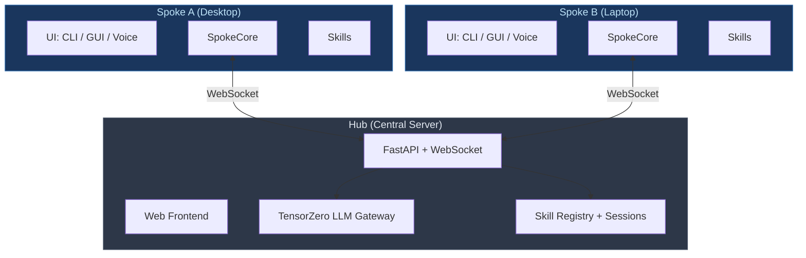

# Strawberry AI Assistant

A multi-device AI assistant platform. A central **Hub** server (typically on a home server or cloud instance) orchestrates LLM calls and routes skill execution across one or more **Spoke** clients on separate machines, each of which can also operate fully offline. Hub and Spoke are independent codebases that communicate over a versioned wire protocol (see [`docs/wire-schema-v1.md`](docs/wire-schema-v1.md)).

For the full architecture description, see [`SUMMARY.md`](SUMMARY.md).



> **Online:** Hub runs the agent loop, executes tools, and routes skill calls to the target Spoke.
> **Offline:** Each Spoke runs its own agent loop and executes local skills directly.

---

## Getting Started

### 1. Create a virtual environment

```bash
python3 -m venv .venv
source .venv/bin/activate   # Linux/macOS
# .venv\Scripts\activate    # Windows
```

### 2. Install

```bash
pip install --quiet -e ai-hub                   # Hub server
pip install --quiet -e "ai-pc-spoke[ui]"        # Spoke with CLI + GUI (recommended)
```

<details>
<summary>Other install flavors</summary>

```bash
pip install -e "ai-pc-spoke"                    # CLI only (no GUI, no voice)
pip install -e "ai-pc-spoke[picovoice,silero]"  # CLI + voice backends
pip install -e "ai-pc-spoke[all]"               # Everything (voice, GUI, dev tools)
```

See [`ai-pc-spoke/README.md`](ai-pc-spoke/README.md) for the full list of extras.
</details>

### 3. Configure

Copy the example environment files and edit them with your API keys:

```bash
cp ai-hub/.env.example ai-hub/.env
cp ai-pc-spoke/.env.example ai-pc-spoke/.env
```

- **Hub:** Edit `ai-hub/.env` and `ai-hub/config/tensorzero.toml` for LLM providers. See the [Hub README](ai-hub/README.md) for details.
- **Spoke:** Edit `ai-pc-spoke/.env` and `ai-pc-spoke/config/settings.yaml` (device name, skill paths) and `ai-pc-spoke/config/tensorzero.toml` for LLM/fallback config. See the [Spoke README](ai-pc-spoke/README.md) for details.

---

## Interfaces

### Hub

```bash
strawberry-hub                          # Start the server
```

The web frontend is served automatically from `ai-hub/frontend/dist/`. See the [Hub README](ai-hub/README.md) for API endpoints and alternative launch commands.

### CLI

```bash
strawberry-cli --help                   # Show all commands
strawberry-cli "What time is it?"       # One-shot message (default)
strawberry-cli --interactive            # Interactive chat REPL
strawberry-cli --settings               # Settings menu
strawberry-cli skill-tester             # Skill interaction tester
```

Type `/voice` for voice mode, `/help` for all commands. See the [CLI README](ai-pc-spoke/src/strawberry/ui/cli/README.md).

### Qt GUI

```bash
strawberry-gui                          # Graphical chat + voice
# or: python -m strawberry.ui.gui_v2
```

### One-Shot / Scripting

The CLI also supports headless one-shot mode for automated testing and scripting:

```bash
strawberry-cli "What is 2+2?"                    # Single message
strawberry-cli "Hello" --json --offline           # JSON output, offline
strawberry-cli "Hello" --quiet                    # Only print final response
```

See the full spec in [`TEST_CLI_DESIGN.md`](ai-pc-spoke/src/strawberry/ui/cli/TEST_CLI_DESIGN.md).

### Voice-Only

```bash
strawberry-voice                        # Wake-word → STT → LLM → TTS loop
```

### Skill Interaction Tester

Step into the LLM's shoes — issue tool calls (`search_skills`, `describe_function`, `python_exec`) against real loaded skills and inspect the exact prompts and results.

```bash
strawberry-cli skill-tester
# Or directly:
python -m strawberry.testing.skill_tester
```

See the [Skill Interaction Tester guide](docs/Skill_Interaction_Tester.md).

---

## Project Structure

```
.
├── ai-hub/                 # Hub server (FastAPI, TensorZero, SQLite)
│   ├── src/hub/            #   Hub application code
│   ├── frontend/           #   React web UI (pre-built in dist/)
│   └── config/             #   tensorzero.toml, tool definitions
├── ai-pc-spoke/            # Spoke client
│   ├── src/strawberry/     #   Main package
│   │   ├── spoke_core/     #     Chat, LLM, skill orchestration
│   │   ├── voice/          #     STT, TTS, wakeword, VAD, audio
│   │   ├── ui/             #     CLI, Qt GUI, Test CLI, Voice UI
│   │   ├── shared/         #     SettingsManager, schemas, storage
│   │   └── skills/         #     Skill loading and sandbox execution
│   ├── skills/             #   User-installed skill repos
│   └── config/             #   settings.yaml, tensorzero.toml
└── docs/                   # Guides, plans, and reference docs
```

For a detailed breakdown, see [`docs/folder-layout.md`](docs/folder-layout.md).

---

## Development

### Running Tests

```bash
strawberry-test                         # Minimal output (writes full log)
strawberry-test --show-all              # Verbose
strawberry-test --failures              # Review failures from last run
```

Hub tests: `cd ai-hub && pytest tests/ --timeout 300`

For the full set of test runner options, see [`docs/TESTING.md`](docs/TESTING.md).

### Code Quality

```bash
ruff check --fix .                      # Lint + auto-fix
```

### Key Rules

- **Type hints** on all functions.
- **Google-style docstrings** for complex code.
- **Run tests + ruff** after every change.
- **Fail loudly** — never suppress errors to make tests pass.
- **Log to files** for debugging.

---

## Further Reading

| Topic | Link |
|-------|------|
| Architecture overview | [`SUMMARY.md`](SUMMARY.md) |
| Hub details & API | [`ai-hub/README.md`](ai-hub/README.md) |
| Spoke details | [`ai-pc-spoke/README.md`](ai-pc-spoke/README.md) |
| Implementing skills | [`docs/Implementing_Skills.md`](docs/Implementing_Skills.md) |
| Testing guide | [`docs/TESTING.md`](docs/TESTING.md) |
| Folder layout | [`docs/folder-layout.md`](docs/folder-layout.md) |
| Offline mode design | [`docs/OFFLINE_MODE_DESIGN.md`](docs/OFFLINE_MODE_DESIGN.md) |
| CLI guide | [`ai-pc-spoke/.../cli/README.md`](ai-pc-spoke/src/strawberry/ui/cli/README.md) |
| CLI design spec | [`ai-pc-spoke/.../cli/TEST_CLI_DESIGN.md`](ai-pc-spoke/src/strawberry/ui/cli/TEST_CLI_DESIGN.md) |
| Skill tester | [`docs/Skill_Interaction_Tester.md`](docs/Skill_Interaction_Tester.md) |
| Wire schema (Hub↔Spoke) | [`docs/wire-schema-v1.md`](docs/wire-schema-v1.md) |