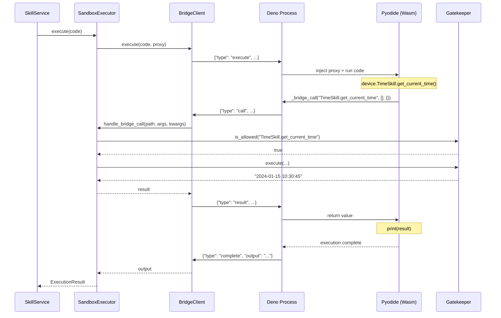

# Sandbox Implementation Plan

This document details the implementation of the secure Pyodide + Deno sandbox for executing LLM-generated code.

---

## Table of Contents

1. [Current State & Problem](#current-state--problem)
2. [Architecture Overview](#architecture-overview)
3. [Implementation Phases](#implementation-phases)
4. [Module Specifications](#module-specifications)
5. [Communication Protocol](#communication-protocol)
6. [Security Implementation](#security-implementation)
7. [Testing Strategy](#testing-strategy)
8. [Rollout Plan](#rollout-plan)

---

## Current State & Problem

### Current Implementation (INSECURE)

```python
# skills/service.py - Current execute_code() 
exec(code, namespace)  # ⚠️ DANGEROUS: Full Python access!
```

**Risks:**
- LLM code has full Python access
- Can import `os`, `subprocess`, `socket`
- Can access filesystem, network, environment variables
- Can crash the Spoke application
- No resource limits (infinite loops possible)

### Target Implementation (SECURE)

```
Python (Spoke) → Deno (Host) → Pyodide (Wasm Guest)
                     ↑                    ↓
                     └── JSON Bridge ─────┘
```

---

## Architecture Overview

```
┌─────────────────────────────────────────────────────────────────────────┐
│                           SPOKE APPLICATION                              │
│                                                                         │
│  ┌─────────────────────────────────────────────────────────────────┐   │
│  │                    SkillService                                  │   │
│  │  ┌─────────────────┐     ┌────────────────────────────────┐    │   │
│  │  │  SkillLoader    │     │     SandboxExecutor            │    │   │
│  │  │  (skills/*.py)  │     │  ┌────────────────────────┐   │    │   │
│  │  └─────────────────┘     │  │   DenoProcessManager   │   │    │   │
│  │                          │  │   - spawn/kill Deno    │   │    │   │
│  │  ┌─────────────────┐     │  │   - timeout handling   │   │    │   │
│  │  │  ProxyGenerator │     │  └──────────┬─────────────┘   │    │   │
│  │  │  (Python→JS)    │     │             │                  │    │   │
│  │  └─────────────────┘     │  ┌──────────▼─────────────┐   │    │   │
│  │                          │  │   BridgeClient         │   │    │   │
│  │  ┌─────────────────┐     │  │   - stdin/stdout JSON  │   │    │   │
│  │  │  Gatekeeper     │     │  │   - request/response   │   │    │   │
│  │  │  (allow-list)   │◄────│──│   - result parsing     │   │    │   │
│  │  └─────────────────┘     │  └────────────────────────┘   │    │   │
│  │                          └────────────────────────────────┘    │   │
│  └─────────────────────────────────────────────────────────────────┘   │
│                                                                         │
│  ┌─────────────────────────────────────────────────────────────────┐   │
│  │                    DENO PROCESS (sandbox_host.ts)                │   │
│  │                                                                  │   │
│  │  ┌──────────────────────────────────────────────────────────┐   │   │
│  │  │                  PYODIDE (Wasm)                           │   │   │
│  │  │  ┌────────────────────────────────────────────────────┐  │   │   │
│  │  │  │                  GUEST PYTHON                       │  │   │   │
│  │  │  │                                                     │  │   │   │
│  │  │  │   device = DeviceProxy()  # Injected                │  │   │   │
│  │  │  │   result = device.TimeSkill.get_current_time()      │  │   │   │
│  │  │  │             │                                       │  │   │   │
│  │  │  │             ▼                                       │  │   │   │
│  │  │  │   _bridge_call("TimeSkill.get_current_time", [])    │  │   │   │
│  │  │  │             │                                       │  │   │   │
│  │  │  └─────────────┼───────────────────────────────────────┘  │   │   │
│  │  │                │                                          │   │   │
│  │  │                ▼                                          │   │   │
│  │  │   ┌─────────────────────────────────────┐                │   │   │
│  │  │   │  Bridge Handler (JS)                 │                │   │   │
│  │  │   │  - Intercept _bridge_call            │                │   │   │
│  │  │   │  - Write JSON to stdout              │                │   │   │
│  │  │   │  - Read result from stdin            │                │   │   │
│  │  │   └─────────────────────────────────────┘                │   │   │
│  │  └──────────────────────────────────────────────────────────┘   │   │
│  └─────────────────────────────────────────────────────────────────┘   │
│                                                                         │
└─────────────────────────────────────────────────────────────────────────┘
```

---

## Implementation Phases

### Phase 1: Core Sandbox Infrastructure
**Estimated: 2-3 hours**

| Task | File | Description |
|------|------|-------------|
| 1.1 | `sandbox/executor.py` | SandboxExecutor class, process management |
| 1.2 | `sandbox/process.py` | DenoProcessManager - spawn, kill, timeout |
| 1.3 | `sandbox/bridge.py` | BridgeClient - JSON communication |
| 1.4 | `sandbox/host.ts` | Deno script with Pyodide setup |

### Phase 2: Proxy & Gatekeeper
**Estimated: 2-3 hours**

| Task | File | Description |
|------|------|-------------|
| 2.1 | `sandbox/proxy_gen.py` | Generate Python proxy code for injection |
| 2.2 | `sandbox/gatekeeper.py` | Validate calls against allow-list |
| 2.3 | Update `service.py` | Integrate SandboxExecutor |

### Phase 3: Security & Hardening
**Estimated: 1-2 hours**

| Task | File | Description |
|------|------|-------------|
| 3.1 | `sandbox/security.py` | Import restrictions, resource limits |
| 3.2 | Update `host.ts` | Add Pyodide restrictions |
| 3.3 | Error sanitization | Don't leak internal info |

### Phase 4: Testing & Integration
**Estimated: 1-2 hours**

| Task | File | Description |
|------|------|-------------|
| 4.1 | `tests/test_sandbox.py` | Unit tests for sandbox |
| 4.2 | Integration tests | End-to-end with skill calls |
| 4.3 | Security tests | Verify isolation |

---

## Module Specifications

### 1. SandboxExecutor

```python
# src/strawberry/skills/sandbox/executor.py

from dataclasses import dataclass
from typing import Optional, Dict, Any, List
import asyncio
import logging

from .process import DenoProcessManager
from .bridge import BridgeClient
from .proxy_gen import ProxyGenerator
from .gatekeeper import Gatekeeper

logger = logging.getLogger(__name__)


@dataclass
class ExecutionResult:
    """Result from sandbox execution."""
    success: bool
    output: Optional[str] = None
    error: Optional[str] = None
    timed_out: bool = False


@dataclass
class SandboxConfig:
    """Sandbox configuration."""
    timeout_seconds: float = 5.0
    memory_limit_mb: int = 128
    deno_path: str = "deno"  # Assumes deno in PATH
    host_script_path: str = None  # Auto-detect


class SandboxExecutor:
    """Executes LLM code in a secure Pyodide sandbox.
    
    Architecture:
    - Spawns Deno process hosting Pyodide
    - Communicates via JSON over stdin/stdout
    - Injects proxy objects for skill calls
    - Enforces timeout and resource limits
    """
    
    def __init__(
        self,
        gatekeeper: Gatekeeper,
        proxy_generator: ProxyGenerator,
        config: SandboxConfig = None,
    ):
        self.gatekeeper = gatekeeper
        self.proxy_generator = proxy_generator
        self.config = config or SandboxConfig()
        
        self._process_manager = DenoProcessManager(
            deno_path=self.config.deno_path,
            host_script=self._get_host_script(),
            timeout=self.config.timeout_seconds,
        )
        self._bridge: Optional[BridgeClient] = None
    
    async def execute(self, code: str) -> ExecutionResult:
        """Execute code in the sandbox.
        
        Args:
            code: Python code to execute
            
        Returns:
            ExecutionResult with output or error
        """
        try:
            # Start sandbox if not running
            if not self._process_manager.is_running:
                await self._start_sandbox()
            
            # Get proxy code to inject
            proxy_code = self.proxy_generator.generate()
            
            # Execute with timeout
            result = await asyncio.wait_for(
                self._execute_in_sandbox(code, proxy_code),
                timeout=self.config.timeout_seconds
            )
            return result
            
        except asyncio.TimeoutError:
            # Hard kill on timeout
            await self._process_manager.kill()
            return ExecutionResult(
                success=False,
                error=f"Execution timeout ({self.config.timeout_seconds}s)",
                timed_out=True,
            )
        except Exception as e:
            logger.error(f"Sandbox execution error: {e}")
            return ExecutionResult(
                success=False,
                error=f"Sandbox error: {self._sanitize_error(str(e))}",
            )
    
    async def handle_bridge_call(
        self, 
        skill_path: str, 
        args: List[Any], 
        kwargs: Dict[str, Any]
    ) -> Any:
        """Handle a skill call from the sandbox.
        
        Called by the bridge when guest code calls device.Skill.method().
        
        Args:
            skill_path: "SkillClass.method_name"
            args: Positional arguments
            kwargs: Keyword arguments
            
        Returns:
            Result from skill execution
        """
        # Validate against allow-list
        if not self.gatekeeper.is_allowed(skill_path):
            raise PermissionError(f"Skill not allowed: {skill_path}")
        
        # Execute the real skill
        return self.gatekeeper.execute(skill_path, args, kwargs)
    
    async def shutdown(self):
        """Shutdown the sandbox."""
        await self._process_manager.kill()
    
    def _sanitize_error(self, error: str) -> str:
        """Remove sensitive info from error messages."""
        # Remove file paths, stack traces with internal info
        # Keep user-facing message only
        if "Traceback" in error:
            lines = error.split("\n")
            # Return just the last line (the actual error)
            return lines[-1] if lines else "Unknown error"
        return error
```

### 2. DenoProcessManager

```python
# src/strawberry/skills/sandbox/process.py

import asyncio
import subprocess
import logging
from pathlib import Path
from typing import Optional

logger = logging.getLogger(__name__)


class DenoProcessManager:
    """Manages the Deno subprocess hosting Pyodide.
    
    Responsibilities:
    - Spawn/kill Deno process
    - Handle timeout/resource limits via Deno flags
    - Provide stdin/stdout streams for bridge
    """
    
    def __init__(
        self,
        deno_path: str = "deno",
        host_script: Path = None,
        timeout: float = 5.0,
        memory_limit_mb: int = 128,
    ):
        self.deno_path = deno_path
        self.host_script = host_script
        self.timeout = timeout
        self.memory_limit_mb = memory_limit_mb
        
        self._process: Optional[asyncio.subprocess.Process] = None
    
    @property
    def is_running(self) -> bool:
        return self._process is not None and self._process.returncode is None
    
    async def start(self) -> tuple:
        """Start Deno process.
        
        Returns:
            (stdin, stdout) streams for communication
        """
        if self.is_running:
            return self._process.stdin, self._process.stdout
        
        # Deno command with security flags
        cmd = [
            self.deno_path,
            "run",
            # Security: No network, no env, limited filesystem
            "--allow-read=.",  # Only current dir
            "--no-prompt",
            # Resource limits via V8 flags
            f"--v8-flags=--max-old-space-size={self.memory_limit_mb}",
            str(self.host_script),
        ]
        
        logger.debug(f"Starting Deno: {' '.join(cmd)}")
        
        self._process = await asyncio.create_subprocess_exec(
            *cmd,
            stdin=asyncio.subprocess.PIPE,
            stdout=asyncio.subprocess.PIPE,
            stderr=asyncio.subprocess.PIPE,
        )
        
        return self._process.stdin, self._process.stdout
    
    async def kill(self):
        """Kill the Deno process immediately."""
        if self._process:
            try:
                self._process.kill()
                await asyncio.wait_for(
                    self._process.wait(),
                    timeout=1.0
                )
            except (ProcessLookupError, asyncio.TimeoutError):
                pass
            finally:
                self._process = None
    
    async def restart(self):
        """Kill and restart the process."""
        await self.kill()
        return await self.start()
```

### 3. BridgeClient

```python
# src/strawberry/skills/sandbox/bridge.py

import json
import asyncio
import logging
from typing import Any, Dict, Callable, Optional
from dataclasses import dataclass

logger = logging.getLogger(__name__)


@dataclass
class BridgeMessage:
    """Message format for bridge communication."""
    type: str  # "execute", "call", "result", "error"
    id: str    # Request ID for correlation
    data: Any  # Payload


class BridgeClient:
    """Handles JSON communication with Deno sandbox.
    
    Protocol:
    - Python → Deno: {"type": "execute", "id": "1", "data": {"code": "...", "proxy": "..."}}
    - Deno → Python: {"type": "call", "id": "1", "data": {"path": "Skill.method", "args": []}}
    - Python → Deno: {"type": "result", "id": "1", "data": {"value": ...}}
    - Deno → Python: {"type": "complete", "id": "1", "data": {"output": "..."}}
    """
    
    def __init__(
        self,
        stdin: asyncio.StreamWriter,
        stdout: asyncio.StreamReader,
        call_handler: Callable[[str, list, dict], Any],
    ):
        self.stdin = stdin
        self.stdout = stdout
        self.call_handler = call_handler
        
        self._pending: Dict[str, asyncio.Future] = {}
        self._request_id = 0
        self._reader_task: Optional[asyncio.Task] = None
    
    async def start(self):
        """Start the message reader task."""
        self._reader_task = asyncio.create_task(self._read_loop())
    
    async def stop(self):
        """Stop the reader task."""
        if self._reader_task:
            self._reader_task.cancel()
            try:
                await self._reader_task
            except asyncio.CancelledError:
                pass
    
    async def execute(self, code: str, proxy_code: str) -> str:
        """Execute code and return output.
        
        Args:
            code: User code to execute
            proxy_code: Proxy injection code
            
        Returns:
            stdout output from execution
        """
        request_id = str(self._request_id)
        self._request_id += 1
        
        # Create future for response
        future = asyncio.Future()
        self._pending[request_id] = future
        
        # Send execute request
        message = {
            "type": "execute",
            "id": request_id,
            "data": {
                "code": code,
                "proxy": proxy_code,
            }
        }
        
        await self._send(message)
        
        # Wait for completion
        return await future
    
    async def _send(self, message: dict):
        """Send JSON message to Deno."""
        line = json.dumps(message) + "\n"
        self.stdin.write(line.encode())
        await self.stdin.drain()
    
    async def _read_loop(self):
        """Read and handle messages from Deno."""
        while True:
            try:
                line = await self.stdout.readline()
                if not line:
                    break
                
                message = json.loads(line.decode())
                await self._handle_message(message)
                
            except json.JSONDecodeError as e:
                logger.error(f"Invalid JSON from sandbox: {e}")
            except asyncio.CancelledError:
                break
            except Exception as e:
                logger.error(f"Bridge read error: {e}")
    
    async def _handle_message(self, message: dict):
        """Handle incoming message from Deno."""
        msg_type = message.get("type")
        msg_id = message.get("id")
        data = message.get("data", {})
        
        if msg_type == "call":
            # Skill call from sandbox - handle and respond
            path = data.get("path")
            args = data.get("args", [])
            kwargs = data.get("kwargs", {})
            
            try:
                result = self.call_handler(path, args, kwargs)
                await self._send({
                    "type": "result",
                    "id": msg_id,
                    "data": {"value": result}
                })
            except Exception as e:
                await self._send({
                    "type": "error", 
                    "id": msg_id,
                    "data": {"error": str(e)}
                })
        
        elif msg_type == "complete":
            # Execution complete
            if msg_id in self._pending:
                self._pending[msg_id].set_result(data.get("output", ""))
                del self._pending[msg_id]
        
        elif msg_type == "error":
            # Execution error
            if msg_id in self._pending:
                self._pending[msg_id].set_exception(
                    RuntimeError(data.get("error", "Unknown error"))
                )
                del self._pending[msg_id]
```

### 4. Deno Host Script

```typescript
// src/strawberry/skills/sandbox/host.ts

import { loadPyodide, PyodideInterface } from "npm:pyodide";

// Initialize Pyodide
let pyodide: PyodideInterface;

async function initPyodide() {
  console.error("[Sandbox] Initializing Pyodide...");
  pyodide = await loadPyodide({
    // Minimal packages - no network access
    indexURL: "https://cdn.jsdelivr.net/pyodide/v0.25.0/full/",
  });
  
  // Set up bridge function that guest Python can call
  pyodide.globals.set("_bridge_call", async (path: string, args: any[], kwargs: any) => {
    // Send call request to Python host
    const id = crypto.randomUUID();
    const message = {
      type: "call",
      id: id,
      data: { path, args, kwargs }
    };
    console.log(JSON.stringify(message));
    
    // Read result from stdin
    const resultLine = await readLine();
    const result = JSON.parse(resultLine);
    
    if (result.type === "error") {
      throw new Error(result.data.error);
    }
    return result.data.value;
  });
  
  console.error("[Sandbox] Pyodide ready");
}

// Read line from stdin
const decoder = new TextDecoder();
const reader = Deno.stdin.readable.getReader();
let buffer = "";

async function readLine(): Promise<string> {
  while (!buffer.includes("\n")) {
    const { value, done } = await reader.read();
    if (done) throw new Error("stdin closed");
    buffer += decoder.decode(value);
  }
  
  const newlineIndex = buffer.indexOf("\n");
  const line = buffer.slice(0, newlineIndex);
  buffer = buffer.slice(newlineIndex + 1);
  return line;
}

// Main loop - process execute requests
async function main() {
  await initPyodide();
  
  while (true) {
    try {
      const line = await readLine();
      const message = JSON.parse(line);
      
      if (message.type === "execute") {
        await handleExecute(message);
      }
    } catch (e) {
      console.error(`[Sandbox] Error: ${e}`);
    }
  }
}

async function handleExecute(message: any) {
  const { id, data } = message;
  const { code, proxy } = data;
  
  try {
    // Inject proxy code first
    if (proxy) {
      await pyodide.runPythonAsync(proxy);
    }
    
    // Capture stdout
    await pyodide.runPythonAsync(`
import sys
from io import StringIO
_stdout_capture = StringIO()
sys.stdout = _stdout_capture
`);
    
    // Execute user code
    await pyodide.runPythonAsync(code);
    
    // Get captured output
    const output = await pyodide.runPythonAsync(`
sys.stdout = sys.__stdout__
_stdout_capture.getvalue()
`);
    
    // Send completion
    console.log(JSON.stringify({
      type: "complete",
      id: id,
      data: { output: output }
    }));
    
  } catch (e) {
    console.log(JSON.stringify({
      type: "error",
      id: id,
      data: { error: String(e) }
    }));
  }
}

main();
```

### 5. ProxyGenerator

```python
# src/strawberry/skills/sandbox/proxy_gen.py

from typing import List, Dict, Any
from ..loader import SkillInfo, SkillMethod


class ProxyGenerator:
    """Generates Python proxy code for injection into sandbox.
    
    The proxy code:
    - Defines a `device` object with skill classes as attributes
    - Each skill method calls _bridge_call() to reach the host
    - Includes search_skills() and describe_function() helpers
    """
    
    def __init__(self, skills: List[SkillInfo]):
        self.skills = skills
        self._cache: str = None
    
    def invalidate(self):
        """Invalidate cached proxy code (call after skill changes)."""
        self._cache = None
    
    def generate(self) -> str:
        """Generate Python proxy code.
        
        Returns:
            Python code to inject into sandbox
        """
        if self._cache:
            return self._cache
        
        lines = [
            "# Auto-generated proxy code - DO NOT EDIT",
            "import json",
            "",
            "class _SkillProxy:",
            "    def __init__(self, skill_name):",
            "        self._skill_name = skill_name",
            "",
            "    def __getattr__(self, method_name):",
            "        def method_proxy(*args, **kwargs):",
            "            path = f'{self._skill_name}.{method_name}'",
            "            return _bridge_call(path, list(args), kwargs)",
            "        return method_proxy",
            "",
            "class _DeviceProxy:",
            "    def __init__(self):",
            "        self._skills = {}",
        ]
        
        # Add skill registry
        skill_data = []
        for skill in self.skills:
            skill_dict = {
                "name": skill.name,
                "methods": [
                    {
                        "name": m.name,
                        "signature": m.signature,
                        "docstring": m.docstring or "",
                    }
                    for m in skill.methods
                ]
            }
            skill_data.append(skill_dict)
        
        lines.append(f"        self._skill_data = {repr(skill_data)}")
        
        # Add skill proxies as attributes
        for skill in self.skills:
            lines.append(f"        self._skills['{skill.name}'] = _SkillProxy('{skill.name}')")
        
        lines.extend([
            "",
            "    def __getattr__(self, name):",
            "        if name in self._skills:",
            "            return self._skills[name]",
            "        available = ', '.join(self._skills.keys())",
            "        raise AttributeError(f'Skill not found: {name}. Available: {available}')",
            "",
            "    def search_skills(self, query=''):",
            "        results = []",
            "        query_lower = query.lower() if query else ''",
            "        for skill in self._skill_data:",
            "            for method in skill['methods']:",
            "                if (not query or",
            "                    query_lower in method['name'].lower() or",
            "                    query_lower in skill['name'].lower() or",
            "                    query_lower in method['docstring'].lower()):",
            "                    results.append({",
            "                        'path': f\"{skill['name']}.{method['name']}\",",
            "                        'signature': method['signature'],",
            "                        'summary': method['docstring'].split('\\n')[0] if method['docstring'] else '',",
            "                    })",
            "        return results",
            "",
            "    def describe_function(self, path):",
            "        parts = path.split('.')",
            "        if len(parts) != 2:",
            "            return f'Invalid path: {path}'",
            "        skill_name, method_name = parts",
            "        for skill in self._skill_data:",
            "            if skill['name'] == skill_name:",
            "                for method in skill['methods']:",
            "                    if method['name'] == method_name:",
            "                        return f\"def {method['signature']}:\\n    \\\"\\\"\\\"{method['docstring']}\\\"\\\"\\\"\"",
            "                return f'Method not found: {method_name}'",
            "        return f'Skill not found: {skill_name}'",
            "",
            "# Create device instance",
            "device = _DeviceProxy()",
        ])
        
        self._cache = "\n".join(lines)
        return self._cache
```

### 6. Gatekeeper

```python
# src/strawberry/skills/sandbox/gatekeeper.py

import logging
from typing import Any, List, Dict, Set, Callable

from ..loader import SkillLoader

logger = logging.getLogger(__name__)


class Gatekeeper:
    """Validates and executes skill calls from the sandbox.
    
    Security:
    - Only allows registered skill methods
    - Logs all calls for audit
    - Sanitizes errors before returning
    """
    
    def __init__(self, loader: SkillLoader):
        self.loader = loader
        self._allow_list: Set[str] = set()
        self._update_allow_list()
    
    def _update_allow_list(self):
        """Rebuild allow-list from current skills."""
        self._allow_list.clear()
        
        for skill in self.loader.get_all_skills():
            for method in skill.methods:
                path = f"{skill.name}.{method.name}"
                self._allow_list.add(path)
        
        # Also allow discovery methods
        self._allow_list.add("device.search_skills")
        self._allow_list.add("device.describe_function")
        
        logger.debug(f"Gatekeeper allow-list: {self._allow_list}")
    
    def refresh(self):
        """Refresh allow-list (call after skill reload)."""
        self._update_allow_list()
    
    def is_allowed(self, path: str) -> bool:
        """Check if a skill path is allowed."""
        return path in self._allow_list
    
    def execute(self, path: str, args: List[Any], kwargs: Dict[str, Any]) -> Any:
        """Execute a skill call.
        
        Args:
            path: "SkillClass.method_name"
            args: Positional arguments
            kwargs: Keyword arguments
            
        Returns:
            Result from skill execution
            
        Raises:
            PermissionError: If path not in allow-list
            ValueError: If skill/method not found
        """
        if not self.is_allowed(path):
            logger.warning(f"Blocked skill call: {path}")
            raise PermissionError(f"Skill not allowed: {path}")
        
        logger.info(f"Executing skill: {path}({args}, {kwargs})")
        
        parts = path.split(".")
        if len(parts) != 2:
            raise ValueError(f"Invalid path format: {path}")
        
        skill_name, method_name = parts
        
        # Get skill class
        skill_info = self.loader.get_skill(skill_name)
        if not skill_info:
            raise ValueError(f"Skill not found: {skill_name}")
        
        # Get method
        method = getattr(skill_info.instance, method_name, None)
        if not method:
            raise ValueError(f"Method not found: {method_name}")
        
        # Execute
        try:
            result = method(*args, **kwargs)
            logger.debug(f"Skill result: {result}")
            return result
        except Exception as e:
            logger.error(f"Skill execution error: {e}")
            # Re-raise with sanitized message
            raise RuntimeError(f"Skill error: {type(e).__name__}: {e}")
```

---

## Communication Protocol

### Message Types

```
Python → Deno:
┌─────────────────────────────────────────────────────────────┐
│ Execute Request                                             │
│ {"type": "execute", "id": "uuid", "data": {                │
│   "code": "print(device.TimeSkill.get_current_time())",    │
│   "proxy": "class _DeviceProxy: ..."                       │
│ }}                                                          │
└─────────────────────────────────────────────────────────────┘

┌─────────────────────────────────────────────────────────────┐
│ Call Result (response to skill call)                        │
│ {"type": "result", "id": "uuid", "data": {                 │
│   "value": "2024-01-15 10:30:45"                           │
│ }}                                                          │
└─────────────────────────────────────────────────────────────┘

┌─────────────────────────────────────────────────────────────┐
│ Call Error (response to skill call)                         │
│ {"type": "error", "id": "uuid", "data": {                  │
│   "error": "Skill error: ValueError: Invalid argument"     │
│ }}                                                          │
└─────────────────────────────────────────────────────────────┘


Deno → Python:
┌─────────────────────────────────────────────────────────────┐
│ Skill Call (proxy calling host)                             │
│ {"type": "call", "id": "uuid", "data": {                   │
│   "path": "TimeSkill.get_current_time",                    │
│   "args": [],                                               │
│   "kwargs": {}                                              │
│ }}                                                          │
└─────────────────────────────────────────────────────────────┘

┌─────────────────────────────────────────────────────────────┐
│ Execution Complete                                          │
│ {"type": "complete", "id": "uuid", "data": {               │
│   "output": "2024-01-15 10:30:45\n"                        │
│ }}                                                          │
└─────────────────────────────────────────────────────────────┘

┌─────────────────────────────────────────────────────────────┐
│ Execution Error                                             │
│ {"type": "error", "id": "uuid", "data": {                  │
│   "error": "NameError: name 'foo' is not defined"          │
│ }}                                                          │
└─────────────────────────────────────────────────────────────┘
```

### Sequence Diagram



---

## Security Implementation

### 1. Deno Sandbox Flags

```bash
deno run \
  --allow-read=.          # Only current directory
  --deny-net              # No network access
  --deny-env              # No environment variables
  --deny-run              # Can't spawn processes
  --deny-write            # Can't write files
  --v8-flags=--max-old-space-size=128  # Memory limit
```

### 2. Pyodide Import Restrictions

```typescript
// In host.ts - before running user code
await pyodide.runPythonAsync(`
import sys

# Remove dangerous modules from available imports
_blocked = ['os', 'sys', 'subprocess', 'socket', 'importlib', 
            'builtins', '__builtins__', 'ctypes', 'multiprocessing']

# Note: Pyodide already blocks most of these, but we double-check
for module in _blocked:
    if module in sys.modules:
        del sys.modules[module]
`);
```

### 3. Timeout Enforcement

```python
# In SandboxExecutor
try:
    result = await asyncio.wait_for(
        self._execute_in_sandbox(code, proxy_code),
        timeout=self.config.timeout_seconds
    )
except asyncio.TimeoutError:
    # HARD KILL - no cleanup
    await self._process_manager.kill()
    return ExecutionResult(
        success=False,
        error=f"Execution timeout ({self.config.timeout_seconds}s)",
        timed_out=True,
    )
```

### 4. Error Sanitization

```python
def _sanitize_error(self, error: str) -> str:
    """Remove internal details from errors."""
    # Remove file paths
    import re
    error = re.sub(r'File "[^"]+",', 'File "<sandbox>",', error)
    
    # Remove internal function names
    error = re.sub(r'in <module>|in \w+', 'in <code>', error)
    
    # Limit length
    if len(error) > 500:
        error = error[:500] + "..."
    
    return error
```

---

## Testing Strategy

### Unit Tests

```python
# tests/test_sandbox.py

import pytest
import asyncio
from strawberry.skills.sandbox import SandboxExecutor, SandboxConfig

@pytest.fixture
def sandbox():
    """Create sandbox executor with mock gatekeeper."""
    # ... setup
    yield executor
    # ... cleanup

class TestSandboxExecution:
    async def test_simple_print(self, sandbox):
        """Basic print should work."""
        result = await sandbox.execute('print("hello")')
        assert result.success
        assert result.output == "hello"
    
    async def test_skill_call(self, sandbox):
        """Skill calls should work through bridge."""
        result = await sandbox.execute(
            'print(device.TimeSkill.get_current_time())'
        )
        assert result.success
        assert ":" in result.output  # Time format
    
    async def test_timeout(self, sandbox):
        """Infinite loops should timeout."""
        result = await sandbox.execute('while True: pass')
        assert not result.success
        assert result.timed_out
    
    async def test_blocked_import(self, sandbox):
        """Dangerous imports should fail."""
        result = await sandbox.execute('import os')
        assert not result.success
        assert "os" in result.error.lower()
    
    async def test_blocked_skill(self, sandbox):
        """Unregistered skills should fail."""
        result = await sandbox.execute(
            'print(device.FakeSkill.hack())'
        )
        assert not result.success
        assert "not found" in result.error.lower()

class TestSandboxSecurity:
    async def test_no_network(self, sandbox):
        """Network access should be blocked."""
        result = await sandbox.execute('''
import urllib.request
urllib.request.urlopen("http://evil.com")
''')
        assert not result.success
    
    async def test_no_file_write(self, sandbox):
        """File writes should be blocked."""
        result = await sandbox.execute('''
with open("/tmp/hack.txt", "w") as f:
    f.write("pwned")
''')
        assert not result.success
    
    async def test_no_subprocess(self, sandbox):
        """Subprocess should be blocked."""
        result = await sandbox.execute('''
import subprocess
subprocess.run(["ls"])
''')
        assert not result.success
```

---

## Rollout Plan

### Step 1: Install Dependencies

```bash
# Install Deno (if not installed)
curl -fsSL https://deno.land/install.sh | sh

# Add to path or specify deno_path in config
```

### Step 2: Update SkillService

```python
# src/strawberry/skills/service.py

class SkillService:
    def __init__(self, skills_path: Path, use_sandbox: bool = True):
        self._loader = SkillLoader(skills_path)
        self._use_sandbox = use_sandbox
        
        if use_sandbox:
            self._sandbox = SandboxExecutor(
                gatekeeper=Gatekeeper(self._loader),
                proxy_generator=ProxyGenerator(self._loader.get_all_skills()),
            )
        else:
            # Fallback to direct exec (dev only)
            self._sandbox = None
    
    async def execute_code(self, code: str) -> SkillCallResult:
        if self._sandbox:
            result = await self._sandbox.execute(code)
            return SkillCallResult(
                success=result.success,
                result=result.output,
                error=result.error,
            )
        else:
            # Legacy direct execution (INSECURE - dev only)
            return self._execute_direct(code)
```

### Step 3: Configuration

```yaml
# config/config.yaml
skills:
  path: "./skills"
  sandbox:
    enabled: true
    timeout_seconds: 5.0
    memory_limit_mb: 128
    deno_path: "deno"  # or full path
```

### Step 4: Feature Flag Rollout

1. **Dev**: `sandbox.enabled: false` (direct exec for debugging)
2. **Test**: `sandbox.enabled: true` (verify security)
3. **Prod**: `sandbox.enabled: true` (required)

---

## File Structure

```
ai-pc-spoke/src/strawberry/skills/
├── __init__.py
├── loader.py          # Existing
├── registry.py        # Existing
├── service.py         # Update to use sandbox
└── sandbox/
    ├── __init__.py
    ├── executor.py    # SandboxExecutor
    ├── process.py     # DenoProcessManager
    ├── bridge.py      # BridgeClient
    ├── proxy_gen.py   # ProxyGenerator
    ├── gatekeeper.py  # Gatekeeper
    └── host.ts        # Deno script
```

---

## Summary

| Component | Purpose | Security Role |
|-----------|---------|---------------|
| **SandboxExecutor** | Orchestrates execution | Timeout enforcement |
| **DenoProcessManager** | Manages Deno process | Resource limits via Deno flags |
| **BridgeClient** | JSON communication | Request/response correlation |
| **ProxyGenerator** | Creates proxy code | Skill interface definition |
| **Gatekeeper** | Validates skill calls | Allow-list enforcement |
| **host.ts** | Deno/Pyodide host | Wasm isolation |

**Total Estimated Time:** 6-10 hours

**Priority:** HIGH - Currently executing LLM code with full Python access!

