# Offline Mode & Hybrid Session Management Design

## Executive Summary

This document describes the design for making the Spoke fully functional in offline mode while seamlessly syncing with the Hub when online. The key insight is to use **TensorZero as middleware** for all LLM calls, leveraging its native fallback mechanism instead of custom code.

---

## Current State Analysis

### Endpoints Used by Spoke

| Endpoint | Purpose | Works Offline? |
|----------|---------|----------------|
| `/health` | Health check | N/A |
| `/auth/me` | Device info | ❌ No |
| `/v1/chat/completions` | LLM chat | ❌ No |
| `/skills/register` | Register skills | ❌ No |
| `/skills/heartbeat` | Keep skills alive | ❌ No |
| `/skills`, `/skills/search` | Skill discovery | ❌ No |
| `/skills/execute` | Remote skill calls | ❌ No |
| `/devices` | List sibling devices | ❌ No |
| `/sessions` | Session CRUD | ❌ No |
| `/sessions/{id}/messages` | Message CRUD | ❌ No |

### Current Problems

1. **Chat Requires Hub**: `main_window.py:409` - If not connected, shows error and refuses to send
2. **No Local LLM**: No TensorZero/direct LLM fallback configured on Spoke
3. **Sessions Hub-Only**: New session system only stores on Hub
4. **Hard Failure Mode**: User gets "Not connected to Hub" instead of degraded functionality
5. **No Session Sync**: No mechanism to merge local sessions when coming back online

---

## Proposed Architecture: TensorZero as Middleware

### Key Insight

Instead of custom fallback code, we use **TensorZero's native fallback mechanism**:
- TensorZero runs locally on the Spoke
- Hub's `/v1/chat/completions` is configured as the **primary provider**
- Local Ollama (or other local LLM) is configured as the **fallback provider**
- TensorZero handles retries, timeouts, and fallbacks automatically
- Response metadata tells us which provider was used → drives offline indicator

### Design Principles

1. **TensorZero-Centric**: All LLM calls go through local TensorZero
2. **Native Fallbacks**: Use TZ's built-in `fallback_variants` instead of custom code
3. **Transparent Switching**: User doesn't need to know which backend answered
4. **Clear Indicators**: App-wide offline mode indicator when using fallback
5. **Local-First Sessions**: Sessions stored locally, synced to Hub when available

### Architecture Overview

```
┌────────────────────────────────────────────────────────────────────────────┐
│                              SPOKE                                          │
│                                                                             │
│  ┌─────────────┐      ┌─────────────────────────────────────────────────┐  │
│  │   UI Layer  │      │              TensorZero Gateway                  │  │
│  │             │      │                (localhost:3000)                  │  │
│  │ MainWindow  │      │  ┌─────────────────────────────────────────┐    │  │
│  │ ChatArea    │ ───► │  │  tensorzero.toml                        │    │  │
│  │ StatusBar   │      │  │                                         │    │  │
│  │             │      │  │  [functions.chat]                       │    │  │
│  │ ┌─────────┐ │      │  │  type = "chat"                          │    │  │
│  │ │ Offline │ │      │  │                                         │    │  │
│  │ │Indicator│ │ ◄─── │  │  [functions.chat.experimentation]       │    │  │
│  │ └─────────┘ │      │  │  candidate_variants = ["hub"]           │    │  │
│  └─────────────┘      │  │  fallback_variants = ["local_ollama"]   │    │  │
│                       │  │                                         │    │  │
│  ┌─────────────┐      │  │  [functions.chat.variants.hub]          │    │  │
│  │SessionStore │      │  │  model = "hub_gateway"                  │    │  │
│  │  (SQLite)   │      │  │                                         │    │  │
│  │             │      │  │  [functions.chat.variants.local_ollama] │    │  │
│  │ - local     │      │  │  model = "ollama_llama3"                │    │  │
│  │ - synced    │      │  └─────────────────────────────────────────┘    │  │
│  │ - pending   │      │                      │                          │  │
│  └──────┬──────┘      └──────────────────────┼──────────────────────────┘  │
│         │                                    │                              │
│         │            ┌───────────────────────┼───────────────────────┐     │
│         │            │                       ▼                       │     │
│         │            │     ┌─────────────────────────────────┐      │     │
│         │            │     │   Model Provider Routing        │      │     │
│         │            │     │                                 │      │     │
│  ┌──────▼──────┐     │     │  hub_gateway ──► Hub:8000       │      │     │
│  │ SyncManager │     │     │       │         /v1/chat        │      │     │
│  │             │     │     │       │ (fail)                  │      │     │
│  │ Push/Pull   │─────┼────►│       ▼                         │      │     │
│  │ Sessions    │     │     │  ollama_llama3 ──► localhost    │      │     │
│  └─────────────┘     │     │                   :11434        │      │     │
│                      │     └─────────────────────────────────┘      │     │
│                      └──────────────────────────────────────────────┘     │
└───────────────────────────────────────────────────────────────────────────┘
                                        │
                    ┌───────────────────┼───────────────────┐
                    │                   ▼                   │
                    │            ┌─────────────┐            │
                    │            │     HUB     │            │
                    │            │             │            │
                    │            │ - LLM APIs  │            │
                    │            │ - Sessions  │            │
                    │            │ - Skills    │            │
                    │            └─────────────┘            │
                    │                                       │
                    │           ┌─────────────┐             │
                    │           │   Ollama    │             │
                    │           │ (localhost) │             │
                    │           │             │             │
                    │           │ llama3.2:3b │             │
                    │           └─────────────┘             │
                    └───────────────────────────────────────┘
```

---

## Detailed Design

### 1. TensorZero Configuration (Spoke-Side)

The Spoke runs its own TensorZero instance that handles all LLM routing with native fallback support.

**`tensorzero.toml` (Spoke)**
```toml
# =============================================================================
# Spoke TensorZero Configuration
# Primary: Hub's LLM gateway (when online)
# Fallback: Local Ollama (when offline)
# =============================================================================

[gateway]
bind_address = "127.0.0.1:3000"

# -----------------------------------------------------------------------------
# Models: Define the LLM backends
# -----------------------------------------------------------------------------

[models.hub_gateway]
# Hub acts as an OpenAI-compatible endpoint
routing = ["hub"]

[models.hub_gateway.providers.hub]
type = "openai"
model_name = "strawberry-chat"  # Hub routes to its configured model
api_base = "http://192.168.1.10:8000/v1"  # Hub URL (configured per device)
api_key_location = "env:HUB_DEVICE_TOKEN"
# Short timeout - fail fast to fallback
timeouts = { non_streaming.total_ms = 5000 }

[models.ollama_local]
# Local Ollama as fallback
routing = ["ollama"]

[models.ollama_local.providers.ollama]
type = "openai"  # Ollama has OpenAI-compatible API
model_name = "llama3.2:3b"
api_base = "http://localhost:11434/v1"
# No API key needed for local Ollama

# -----------------------------------------------------------------------------
# Functions: Define chat with fallback behavior
# -----------------------------------------------------------------------------

[functions.chat]
type = "chat"
system_schema = "config/system_schema.json"

# Experimentation config: try hub first, fall back to local
[functions.chat.experimentation]
type = "uniform"
candidate_variants = ["hub"]
fallback_variants = ["local_ollama"]

# Hub variant - primary choice when online
[functions.chat.variants.hub]
type = "chat_completion"
model = "hub_gateway"
# Retry once before falling back
retries = { num_retries = 1, max_delay_s = 2 }

# Local Ollama variant - fallback when hub unavailable
[functions.chat.variants.local_ollama]
type = "chat_completion"
model = "ollama_local"
# Local should be reliable, but retry once
retries = { num_retries = 1, max_delay_s = 1 }
```

### 2. Detecting Offline Mode (Response Metadata)

TensorZero responses include metadata about which variant was used. We use this to drive the offline indicator.

```python
class TensorZeroClient:
    """Client for local TensorZero gateway."""
    
    async def chat(self, messages: List[ChatMessage], **kwargs) -> ChatResponse:
        """Send chat request to local TensorZero."""
        response = await self._client.post(
            "http://localhost:3000/inference",
            json={
                "function_name": "chat",
                "input": {
                    "messages": [{"role": m.role, "content": m.content} for m in messages]
                },
                **kwargs
            }
        )
        data = response.json()
        
        # Extract which variant was used
        variant_used = data.get("variant_name", "unknown")
        is_offline = variant_used == "local_ollama"
        
        return ChatResponse(
            content=data["content"][0]["text"],
            model=data.get("model", "unknown"),
            variant=variant_used,
            is_fallback=is_offline,
            raw=data,
        )
```

### 3. App-Wide Offline Mode Indicator

The offline state is derived from TensorZero responses, not from explicit connection checks.

```python
class OfflineModeTracker:
    """Tracks offline mode based on TensorZero responses."""
    
    def __init__(self):
        self._consecutive_fallbacks = 0
        self._is_offline = False
        self._last_hub_success: Optional[datetime] = None
        self._listeners: List[Callable[[bool], None]] = []
    
    def on_response(self, response: ChatResponse):
        """Update offline state based on response."""
        if response.is_fallback:
            self._consecutive_fallbacks += 1
            if self._consecutive_fallbacks >= 2:
                self._set_offline(True)
        else:
            self._consecutive_fallbacks = 0
            self._last_hub_success = datetime.now()
            self._set_offline(False)
    
    def _set_offline(self, offline: bool):
        if offline != self._is_offline:
            self._is_offline = offline
            for listener in self._listeners:
                listener(offline)
    
    @property
    def is_offline(self) -> bool:
        return self._is_offline
    
    def add_listener(self, callback: Callable[[bool], None]):
        self._listeners.append(callback)
```

### 4. Local Session Storage (SQLite)

Sessions are stored locally first, synced to Hub when online.

**Schema:**
```sql
-- Local sessions table
CREATE TABLE local_sessions (
    id TEXT PRIMARY KEY,           -- UUID, locally generated
    hub_id TEXT,                   -- Hub's session ID after sync (NULL if not synced)
    title TEXT,
    created_at TIMESTAMP,
    last_activity TIMESTAMP,
    is_synced BOOLEAN DEFAULT FALSE,
    sync_status TEXT DEFAULT 'local'  -- 'local', 'synced', 'pending_sync'
);

-- Local messages table  
CREATE TABLE local_messages (
    id INTEGER PRIMARY KEY AUTOINCREMENT,
    session_id TEXT REFERENCES local_sessions(id),
    hub_message_id INTEGER,        -- Hub's message ID after sync
    role TEXT,                     -- user, assistant, system
    content TEXT,
    created_at TIMESTAMP,
    is_synced BOOLEAN DEFAULT FALSE
);

-- Sync queue for offline operations
CREATE TABLE sync_queue (
    id INTEGER PRIMARY KEY AUTOINCREMENT,
    operation TEXT,                -- 'create_session', 'add_message', 'delete_session'
    payload TEXT,                  -- JSON payload
    created_at TIMESTAMP,
    attempts INTEGER DEFAULT 0
);
```

### 5. Session Manager

Manages session lifecycle with automatic sync.

```python
class SessionManager:
    """Manages sessions locally with Hub sync."""
    
    def __init__(self, db_path: Path, hub_client: Optional[HubClient]):
        self.db = LocalSessionDB(db_path)
        self.hub_client = hub_client
        self.sync_manager = SyncManager(self.db, hub_client)
    
    async def create_session(self) -> Session:
        """Create a new session (always local first)."""
        session = self.db.create_session()
        
        # Queue for sync if online
        if self.hub_client:
            await self.sync_manager.queue_create_session(session)
        
        return session
    
    async def list_sessions(self) -> List[Session]:
        """List all sessions (local + remote)."""
        local_sessions = self.db.list_sessions()
        
        # If online, also fetch remote sessions not yet synced locally
        if self.hub_client and await self._hub_available():
            remote_sessions = await self.hub_client.list_sessions()
            merged = self._merge_sessions(local_sessions, remote_sessions)
            return merged
        
        return local_sessions
    
    async def add_message(self, session_id: str, role: str, content: str) -> Message:
        """Add message to session."""
        message = self.db.add_message(session_id, role, content)
        
        # Queue for sync
        if self.hub_client:
            await self.sync_manager.queue_add_message(session_id, message)
        
        return message
```

### 6. Sync Manager

Handles bidirectional sync between local and Hub storage.

```python
class SyncManager:
    """Manages sync between local storage and Hub."""
    
    async def sync_all(self):
        """Full bidirectional sync."""
        if not await self._hub_available():
            return
        
        # 1. Push pending local changes to Hub
        await self._push_pending()
        
        # 2. Pull remote sessions we don't have locally
        await self._pull_remote()
    
    async def _push_pending(self):
        """Push queued operations to Hub."""
        pending = self.db.get_pending_sync()
        
        for op in pending:
            try:
                if op.operation == 'create_session':
                    hub_session = await self.hub_client.create_session()
                    self.db.mark_session_synced(op.local_id, hub_session['id'])
                
                elif op.operation == 'add_message':
                    # Find the Hub session ID for this local session
                    hub_session_id = self.db.get_hub_session_id(op.session_id)
                    if hub_session_id:
                        await self.hub_client.add_session_message(
                            hub_session_id, op.role, op.content
                        )
                        self.db.mark_message_synced(op.message_id)
                
                self.db.remove_from_sync_queue(op.id)
            
            except HubError as e:
                logger.warning(f"Sync failed for {op.operation}: {e}")
                self.db.increment_sync_attempts(op.id)
    
    async def _pull_remote(self):
        """Pull remote sessions we don't have locally."""
        remote_sessions = await self.hub_client.list_sessions()
        
        for remote in remote_sessions:
            if not self.db.has_hub_session(remote['id']):
                # Import remote session locally
                local_session = self.db.import_remote_session(remote)
                
                # Also fetch messages
                messages = await self.hub_client.get_session_messages(remote['id'])
                for msg in messages:
                    self.db.import_remote_message(local_session.id, msg)
```

---

## Sequence Diagrams

### Online Mode: Send Message (via TensorZero)

```mermaid
sequenceDiagram
    participant U as User
    participant UI as MainWindow
    participant SM as SessionManager
    participant TZ as TensorZero<br/>(localhost:3000)
    participant Hub as Hub Server
    participant DB as Local SQLite

    U->>UI: Type message
    UI->>SM: add_message(session_id, "user", text)
    SM->>DB: Store message locally
    SM->>SM: Queue sync operation
    
    UI->>TZ: POST /inference (function: chat)
    TZ->>Hub: POST /v1/chat/completions
    Hub-->>TZ: Response
    TZ-->>UI: ChatResponse {variant: "hub"}
    
    UI->>UI: OfflineModeTracker.on_response()
    Note over UI: variant="hub" → online mode
    
    UI->>SM: add_message(session_id, "assistant", response)
    SM->>DB: Store message locally
    SM->>SM: Queue sync operation
    
    Note over SM,Hub: Background sync pushes to Hub
    SM->>Hub: POST /sessions/{id}/messages
```



### Offline Mode: Send Message (TensorZero Fallback)

```mermaid
sequenceDiagram
    participant U as User
    participant UI as MainWindow
    participant SM as SessionManager
    participant TZ as TensorZero<br/>(localhost:3000)
    participant Hub as Hub Server
    participant Ollama as Local Ollama
    participant DB as Local SQLite

    U->>UI: Type message
    UI->>SM: add_message(session_id, "user", text)
    SM->>DB: Store message locally
    SM->>DB: Queue in sync_queue (for later)
    
    UI->>TZ: POST /inference (function: chat)
    TZ->>Hub: POST /v1/chat/completions
    Hub--xTZ: Connection failed / timeout
    
    Note over TZ: Fallback triggered
    TZ->>Ollama: POST /v1/chat/completions
    Ollama-->>TZ: Response
    TZ-->>UI: ChatResponse {variant: "local_ollama"}
    
    UI->>UI: OfflineModeTracker.on_response()
    Note over UI: variant="local_ollama" → offline mode
    UI->>UI: Show offline indicator
    
    UI->>SM: add_message(session_id, "assistant", response)
    SM->>DB: Store message locally
    SM->>DB: Queue in sync_queue
    
    Note over DB: Messages stored locally,<br/>sync queued for when online
```



### Reconnection: Sync Flow


### Session List: Merged View

```mermaid
sequenceDiagram
    participant UI as ChatHistorySidebar
    participant SM as SessionManager
    participant DB as Local SQLite
    participant Hub as Hub Server

    UI->>SM: list_sessions()
    SM->>DB: Get local sessions
    DB-->>SM: [local sessions]
    
    alt Hub Available
        SM->>Hub: GET /sessions
        Hub-->>SM: [remote sessions]
        SM->>SM: Merge (dedupe by hub_id)
        SM-->>UI: [merged sessions]
    else Hub Unavailable
        SM-->>UI: [local sessions only]
    end
    
    Note over UI: Display with indicators:<br/>🔵 Synced<br/>🟡 Local only<br/>☁️ Remote only
```



---

## Implementation Caveats & Solutions

### Caveat 1: Session ID Mismatch

**Problem:** Local sessions use UUID, Hub generates different IDs. After sync, we have two IDs for the same session.

**Solution:** 
- Store both `id` (local) and `hub_id` (remote) in local DB
- Use local ID internally, hub_id for API calls
- Merge logic uses hub_id to detect duplicates

```python
class Session:
    id: str           # Local UUID, never changes
    hub_id: str       # Hub's ID after sync, NULL until synced
```

### Caveat 2: Message Ordering

**Problem:** Messages created offline may have timestamps that conflict with messages created on other devices.

**Solution:**
- Use logical ordering (sequence number within session) not timestamps
- On sync, append messages in creation order
- Hub stores `sequence_number` per message

### Caveat 3: Conflict Resolution

**Problem:** User deletes session locally while offline, but another device added messages.

**Solution:**
- **Last-write-wins** for simple cases
- Deleted sessions stay in local DB with `deleted_at` timestamp
- On sync, if Hub has newer messages, prompt user to confirm delete
- For MVP: local delete wins (simpler)

### Caveat 4: Local LLM Quality

**Problem:** Local LLM (e.g., Ollama with small model) may be lower quality than Hub's LLM.

**Solution:**
- Let user configure local model in `config.yaml`
- Show indicator when using local vs Hub LLM
- Allow model override in settings dialog

```yaml
# config.yaml
local_llm:
  enabled: true
  provider: ollama
  model: llama3.2:3b  # Smaller model for local
  url: http://localhost:11434/v1
```

### Caveat 5: Large Sync Payloads

**Problem:** User creates many sessions offline, sync could be slow.

**Solution:**
- Sync in batches (10 sessions at a time)
- Show progress indicator during sync
- Background sync with low priority
- Skip message content in session list, lazy-load on select

### Caveat 6: Storage Limits

**Problem:** Local SQLite could grow unbounded.

**Solution:**
- Configurable max local sessions (default: 100)
- Auto-archive old synced sessions (keep in Hub, remove local copy)
- Clear local-only sessions older than 30 days

---

## UI Changes

### Session List Indicators

```
┌─────────────────────────────────┐
│ Chat History              [+]  │
├─────────────────────────────────┤
│ 🔵 How do I parse JSON?        │  ← Synced with Hub
│    12 messages · 2 hours ago   │
├─────────────────────────────────┤
│ 🟡 Local test conversation     │  ← Local only, pending sync
│    3 messages · 5 min ago      │
├─────────────────────────────────┤
│ ☁️  Meeting notes from phone    │  ← From another device
│    8 messages · Yesterday      │
└─────────────────────────────────┘
```

### Status Bar

```
┌─────────────────────────────────────────────────────────┐
│ 🟢 Online · Hub: 192.168.1.10 · Model: gemini-2.5-flash │
└─────────────────────────────────────────────────────────┘

┌─────────────────────────────────────────────────────────┐
│ 🟡 Offline · Local Model: llama3.2:3b · 3 pending sync  │
└─────────────────────────────────────────────────────────┘
```

---

## App-Wide Offline Mode Indicator

### Design Goals

1. **Always visible** - User should know at a glance if they're online or offline
2. **Non-intrusive** - Shouldn't block the UI or require dismissal
3. **Informative** - Show which model is being used and sync status
4. **Actionable** - Click to see details or trigger manual sync

### UI Mockup

```
┌────────────────────────────────────────────────────────────────────┐
│ ┌──────────────────────────────────────────────────────────────┐  │
│ │                    OFFLINE MODE BANNER                       │  │
│ │  ⚠️ Using local model (llama3.2:3b) · 5 messages pending sync │  │
│ └──────────────────────────────────────────────────────────────┘  │
│                                                                    │
│  ┌────────────┐  ┌──────────────────────────────────────────────┐ │
│  │ Chat       │  │  🍓 Strawberry AI                    🟡      │ │
│  │ History    │  ├──────────────────────────────────────────────┤ │
│  │            │  │                                              │ │
│  │ 🟡 Chat 1  │  │  User: What's the weather?                   │ │
│  │ 🟡 Chat 2  │  │                                              │ │
│  │ 🔵 Chat 3  │  │  Assistant: I can help with that...         │ │
│  │            │  │  [Answered by local model]                   │ │
│  └────────────┘  │                                              │ │
│                  └──────────────────────────────────────────────┘ │
│  ┌──────────────────────────────────────────────────────────────┐ │
│  │ 🟡 Offline · Local: llama3.2:3b · 5 pending │  [Sync Now]   │ │
│  └──────────────────────────────────────────────────────────────┘ │
└────────────────────────────────────────────────────────────────────┘
```

### Status Indicator States

| State | Icon | Color | Description |
|-------|------|-------|-------------|
| Online (Hub) | 🟢 | Green | Connected to Hub, using Hub's LLM |
| Offline (Local) | 🟡 | Yellow | Using local Ollama, sync pending |
| Syncing | 🔄 | Blue | Actively syncing with Hub |
| Error | 🔴 | Red | Both Hub and local failed |

### Implementation

```python
class OfflineModeBanner(QFrame):
    """Banner shown when in offline mode."""
    
    sync_requested = Signal()
    
    def __init__(self, theme, parent=None):
        super().__init__(parent)
        self.setObjectName("offlineBanner")
        self.setVisible(False)  # Hidden by default
        
        layout = QHBoxLayout(self)
        
        # Warning icon
        self._icon = QLabel("⚠️")
        layout.addWidget(self._icon)
        
        # Status text
        self._text = QLabel()
        layout.addWidget(self._text, 1)
        
        # Sync button
        self._sync_btn = QPushButton("Sync Now")
        self._sync_btn.clicked.connect(self.sync_requested.emit)
        layout.addWidget(self._sync_btn)
    
    def set_offline(self, model_name: str, pending_count: int):
        """Show offline banner with status."""
        self._text.setText(
            f"Using local model ({model_name}) · "
            f"{pending_count} messages pending sync"
        )
        self.setVisible(True)
    
    def set_online(self):
        """Hide banner when online."""
        self.setVisible(False)
```

---

## Implementation Order

1. **Phase 1: TensorZero Setup**
   - Create Spoke-side `tensorzero.toml` with Hub + Ollama fallback
   - Add TensorZero process management to Spoke startup
   - Create `TensorZeroClient` to replace direct Hub calls

2. **Phase 2: Offline Mode Detection**
   - Implement `OfflineModeTracker` based on TZ response metadata
   - Add `OfflineModeBanner` widget to MainWindow
   - Update status bar to show current model/variant

3. **Phase 3: Local Session Storage**
   - Create SQLite schema for local sessions
   - Implement `LocalSessionDB` class
   - Migrate `SessionManager` to use local-first storage

4. **Phase 4: Sync Infrastructure**
   - Implement `SyncManager` with queue
   - Add background sync task (triggered when variant changes to "hub")
   - Handle reconnection events

5. **Phase 5: UI Polish**
   - Add sync status indicators to session list (🔵/🟡/☁️)
   - Add "Answered by local model" indicator on messages
   - Add sync progress indicator

6. **Phase 6: Testing & Edge Cases**
   - Test offline → online transitions
   - Test TensorZero fallback behavior
   - Test multi-device sync scenarios

---

## Files to Create/Modify

### New Files
- `ai-pc-spoke/config/tensorzero.toml` - TensorZero config with fallback
- `ai-pc-spoke/src/strawberry/llm/tensorzero_client.py` - TZ client wrapper
- `ai-pc-spoke/src/strawberry/llm/offline_tracker.py` - Offline mode detection
- `ai-pc-spoke/src/strawberry/storage/session_db.py` - Local SQLite storage
- `ai-pc-spoke/src/strawberry/storage/sync_manager.py` - Sync logic
- `ai-pc-spoke/src/strawberry/ui/widgets/offline_banner.py` - Offline mode banner

### Modified Files
- `ai-pc-spoke/src/strawberry/ui/main_window.py` - Use TensorZeroClient, add banner
- `ai-pc-spoke/src/strawberry/ui/widgets/chat_history.py` - Add sync indicators
- `ai-pc-spoke/src/strawberry/ui/widgets/status_bar.py` - Show model + sync status
- `ai-pc-spoke/src/strawberry/config/settings.py` - Add TensorZero/local LLM settings
- `ai-pc-spoke/src/strawberry/ui/app.py` - Start TensorZero process on launch

---

## Key Architectural Decisions

### Why TensorZero as Middleware (Not Custom Fallback)?

| Approach | Pros | Cons |
|----------|------|------|
| **Custom LLMRouter** | Full control, no extra process | More code to maintain, reinvent fallback logic |
| **TensorZero Middleware** | Native retries/fallbacks, battle-tested, observability | Extra process to manage, learning curve |

**Decision:** TensorZero as middleware because:
1. Fallback logic is already implemented and tested
2. Built-in retry with exponential backoff
3. Response metadata tells us which variant was used
4. Future: can add A/B testing, metrics collection
5. Matches Hub architecture (Hub also uses TensorZero)

### Data Flow Summary

```
┌─────────────────────────────────────────────────────────────────────────┐
│                            SPOKE DATA FLOW                               │
│                                                                          │
│  User Message                                                            │
│       │                                                                  │
│       ▼                                                                  │
│  ┌─────────┐    ┌────────────┐    ┌─────────────┐    ┌──────────────┐  │
│  │ UI      │───►│ Session    │───►│ TensorZero  │───►│ Hub or       │  │
│  │         │    │ Manager    │    │ Gateway     │    │ Local Ollama │  │
│  └─────────┘    └─────┬──────┘    └──────┬──────┘    └──────────────┘  │
│       ▲               │                  │                              │
│       │               ▼                  ▼                              │
│       │         ┌──────────┐      ┌──────────────┐                     │
│       │         │ Local    │      │ Response     │                     │
│       │         │ SQLite   │      │ + variant    │                     │
│       │         └────┬─────┘      └──────┬───────┘                     │
│       │              │                   │                              │
│       │              ▼                   ▼                              │
│       │         ┌──────────┐      ┌──────────────┐                     │
│       └─────────│ Sync     │◄─────│ Offline      │                     │
│                 │ Manager  │      │ Tracker      │                     │
│                 └──────────┘      └──────────────┘                     │
│                      │                                                  │
│                      ▼ (when online)                                    │
│                 ┌──────────┐                                            │
│                 │ Hub API  │                                            │
│                 │ /sessions│                                            │
│                 └──────────┘                                            │
└─────────────────────────────────────────────────────────────────────────┘
```

---

## Open Questions

1. **Should we support partial sync?** (e.g., sync only recent sessions)
2. **How to handle Hub session deletion?** (soft delete locally? prompt user?)
3. **Should offline sessions auto-sync or require user action?**
4. **Multi-user on same device?** (different local DBs per user?)
5. **TensorZero process management**: Embedded in Spoke or separate service?
6. **What if both Hub AND local Ollama are unavailable?** (show error, queue message?)
