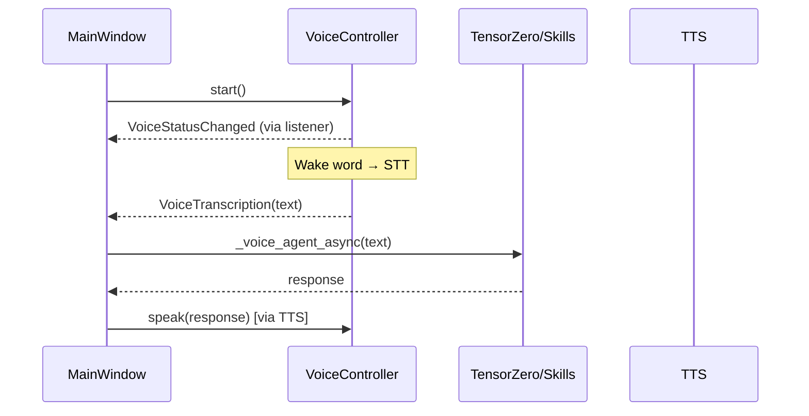

# Qt Voice UI - Direct Integration Plan

Remove `QtVoiceAdapter` and use `VoiceController` directly in `main_window.py`.

## Problem

The current flow adds unnecessary indirection:
```
VoiceController → QtVoiceAdapter → Qt Signals → main_window handlers
```

The adapter was designed for SpokeCore integration (now removed). What remains is just signal translation that can be done inline.

## Target Architecture



## Changes

### [DELETE] [qt_voice_adapter.py](file:///mnt/A0FCD2A8FCD2784C/Documents%20Offline/capstone%20v2/ai-pc-spoke/src/strawberry/ui/qt/qt_voice_adapter.py)

Remove the adapter entirely.

---

### [MODIFY] [main_window.py](file:///mnt/A0FCD2A8FCD2784C/Documents%20Offline/capstone%20v2/ai-pc-spoke/src/strawberry/ui/qt/main_window.py)

1. Import `VoiceController` directly from `strawberry.voice`
2. Add a voice event listener that uses `QMetaObject.invokeMethod` for thread-safe UI updates
3. In `_enable_voice()`: create `VoiceController(VoiceConfig(...))`, set response handler, add listener
4. Handle `VoiceTranscription` event to call `_voice_agent_async()` and then `VoiceController.speak()`
5. Remove unused Qt signal connections

**Key change**: Voice response handling moves from `response_handler` callback to event-based flow:
- `VoiceTranscription` event → get response via `_voice_agent_async` → call TTS directly

---

### Voice Event → Qt Thread-Safe Pattern

```python
from PySide6.QtCore import QMetaObject, Qt, Q_ARG

def _on_voice_event(self, event: VoiceEvent):
    """Handle voice events (called from voice thread)."""
    # Thread-safe invocation on Qt main thread
    QMetaObject.invokeMethod(
        self,
        "_handle_voice_event_main_thread",
        Qt.QueuedConnection,
        Q_ARG(object, event),
    )

@Slot(object)
def _handle_voice_event_main_thread(self, event: VoiceEvent):
    """Process voice event on main Qt thread."""
    if isinstance(event, VoiceStatusChanged):
        self._voice_indicator.set_state(event.state.name.lower())
    elif isinstance(event, VoiceTranscription):
        self._handle_voice_transcription(event.text)
    # ... etc
```

## Verification

1. Run voice tests: `strawberry-test tests/test_voice_controller.py`
2. Launch Qt UI and test voice: wake word → transcription → response → TTS
