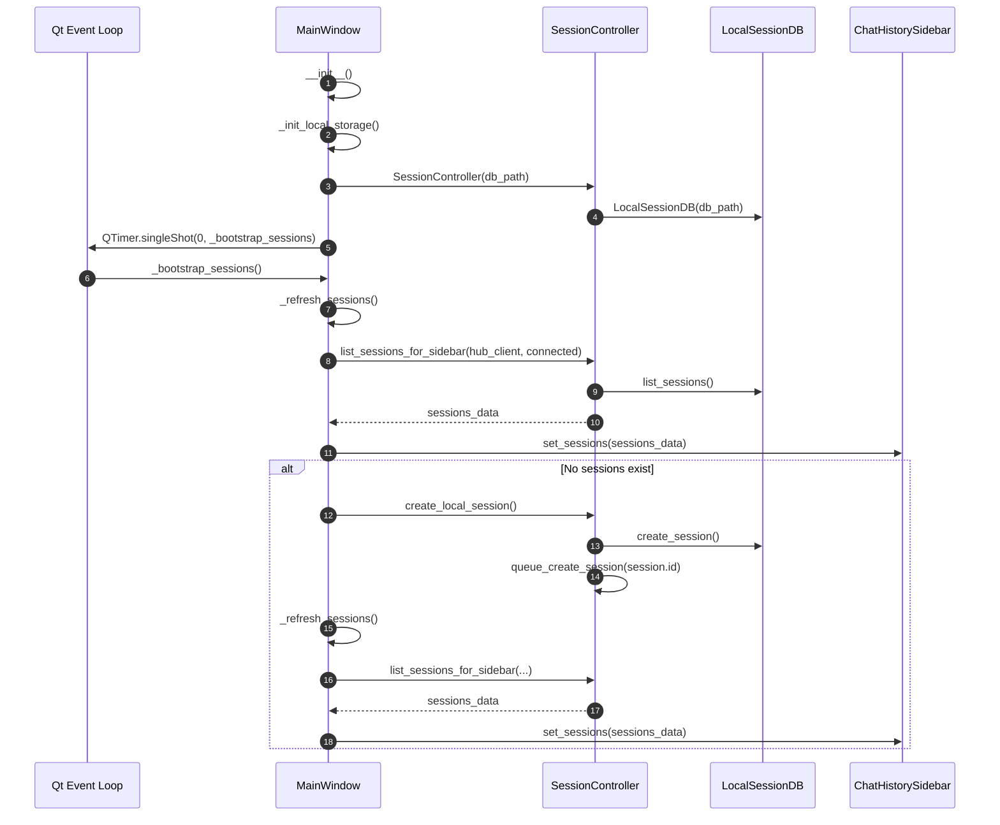
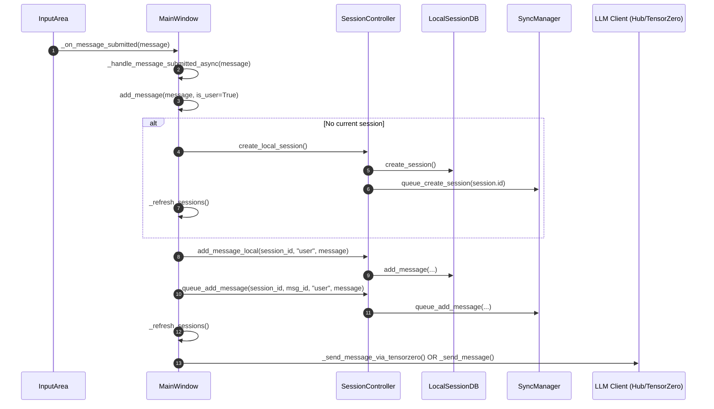
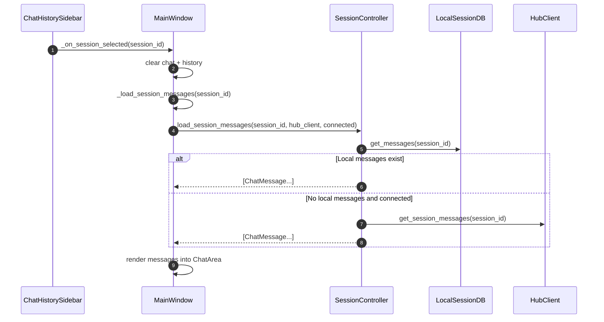
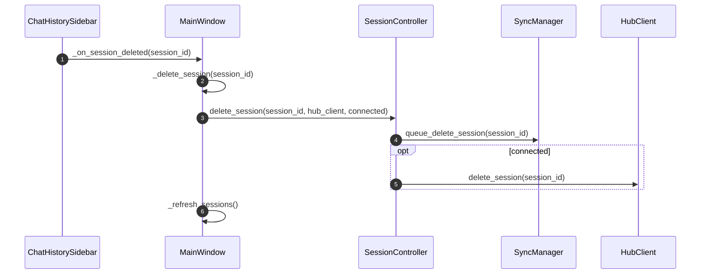
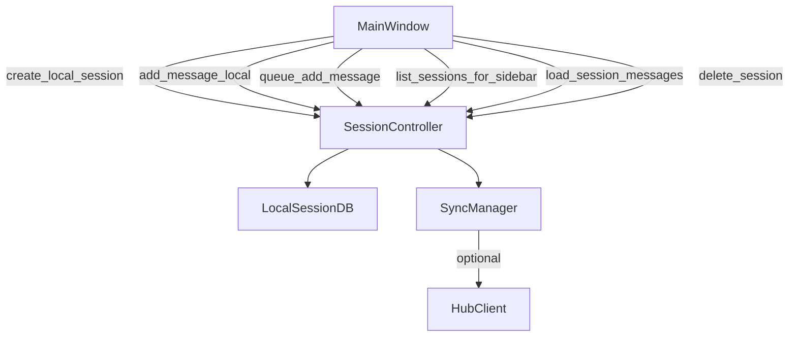

# AI-PC-Spoke Code Review

**Last Updated**: 2026-01-11

## Scope
This review covers the ai-pc-spoke codebase, focusing on:
- Code simplification opportunities
- UI improvements
- Architecture concerns
- Easy wins for implementation

## Status Legend
- **Easy Win**: Simple fix, low risk, can implement now
- **Consider**: Good improvement but needs more work or has downstream impact
- **Question**: Needs clarification
- **OK**: Solid as-is
- **Fixed**: Issue resolved

---

## Codebase Metrics (2026-01-11)

| Metric | Value |
|--------|-------|
| Source files | ~70 Python files |
| Total source LOC | ~17,000 lines |
| Test files | 23 files |
| Test LOC | ~5,200 lines |
| Tests passing | 319 |
| Ruff warnings | 0 |
| Test warnings | 0 |

### Largest Files
| File | Lines | Status |
|------|-------|--------|
| `ui/main_window.py` | 1,570 | Consider splitting |
| `skills/service.py` | 1,311 | Consider splitting |
| `hub/client.py` | 738 | OK |
| `storage/session_db.py` | 724 | OK |
| `ui/settings_dialog.py` | 623 | OK |

## Structure Overview
```
src/strawberry/
├── audio/      # Audio I/O (8 items)
├── config/     # Configuration management (6 items)
├── hub/        # Hub client connection (2 items)
├── llm/        # LLM integration (3 items)
├── pipeline/   # Conversation orchestration (3 items)
├── skills/     # Skill loading/execution (12 items)
├── storage/    # Data persistence (3 items)
├── stt/        # Speech-to-text (5 items)
├── terminal.py # Terminal UI (458 lines)
├── testing/    # Test framework (2 items)
├── tts/        # Text-to-speech (5 items)
├── ui/         # PySide6 GUI (19 items)
├── vad/        # Voice activity detection (6 items)
└── wake/       # Wake word detection (5 items)
```

---

## Recently Fixed (2026-01-11)

### Test Suite Warnings - All Resolved
**Status: Fixed**

1. **`datetime.utcnow()` Deprecation (Python 3.12)**
   - Replaced all `datetime.utcnow()` with timezone-aware `datetime.now(timezone.utc)`
   - Files fixed: `storage/session_db.py`, `ui/widgets/chat_history.py`, tests
   - Added helper functions `_utc_now()`, `_to_utc()`, `_parse_datetime()` for consistent handling

2. **SQLite Datetime Adapter Deprecation (Python 3.12)**
   - All datetime values now stored as ISO strings (not datetime objects)
   - Avoids deprecated default datetime adapter

3. **Pydantic V2 Deprecation Warning**
   - Replaced `class Config:` with `model_config = ConfigDict(...)` in `config/settings.py`

4. **websockets Legacy API Deprecation**
   - Updated `hub/client.py` to use `websockets.asyncio.client.ClientConnection` instead of deprecated `WebSocketClientProtocol`

5. **PySide6 Import Failures in Headless Tests**
   - Made `ui/widgets/__init__.py` conditionally import Qt widgets
   - Made `assistant_turn_widget.py` importable without PySide6
   - `_parse_chunks()` function available for headless unit tests

---

## Findings

### 1) main_window.py is too large (1,570 lines)
**Status: Consider**

The file handles:
- UI setup and theming
- Hub connection management
- TensorZero integration
- Session management (local + Hub)
- Voice controller integration
- Settings persistence
- Agent loop execution (2 similar implementations)

**Recommendation**: Extract into smaller modules:
- `chat_controller.py` - Agent loop logic (~200 lines)
- `session_controller.py` - Session CRUD (~150 lines)
- `hub_manager.py` - Hub connection lifecycle (~100 lines)

**Downstream impact**: Medium - needs careful refactoring to maintain signal/slot connections.

### 2) Duplicate agent loops: `_send_message` vs `_send_message_via_tensorzero`
**Status: Easy Win**

Both methods implement nearly identical agent loops (5 iterations, code block parsing, tool execution, UI updates). Only difference is the LLM client used.

**Lines**: 532-698 (`_send_message`) and 700-889 (`_send_message_via_tensorzero`)

**Recommendation**: Extract common agent loop logic into a single method that accepts an LLM client interface.

### 4) Duplicate `ChatResponse` classes with different fields
**Status: Consider**

- `hub/client.py:54-60` - has `content, model, finish_reason, raw`
- `llm/tensorzero_client.py:48-57` - has `content, model, variant, is_fallback, inference_id, tool_calls, raw`

**Recommendation**: Create a unified response type or clear inheritance. The TensorZero response is a superset.

### 5) service.py is large (1,311 lines)
**Status: Consider**

Contains:
- `SkillService` class (~500 lines)
- `_DeviceProxy` class (~100 lines)
- `_SkillProxy` class (~20 lines)
- `_DeviceManagerProxy` class (~150 lines)
- Tool execution logic

**Recommendation**: Already has some separation. Could extract proxy classes to `proxies.py`.

### 6) Terminal mode doesn't use TensorZero
**Status: Question**

`terminal.py` only uses `HubClient` directly, missing TensorZero's fallback capabilities. Users running in terminal mode won't get local LLM fallback.

**Options**:
- Add TensorZero support to terminal mode
- Document limitation
- Keep simple for terminal use case

### 7) Hardcoded endpoint in voice response handler
**Status: Easy Win**

In `main_window.py:1138-1146`, the voice response uses a hardcoded HTTP client instead of the shared HubClient:

```python
response = await client.post(
    "/api/v1/chat/completions",
    ...
)
```

This duplicates the Hub API logic and bypasses retry/error handling.

**Recommendation**: Refactor to use shared client or add a note explaining the thread-safety requirement.

### 9) UI Widget organization is good
**Status: OK**

Widgets are well-organized in `ui/widgets/` with reasonable file sizes:
- `assistant_turn_widget.py` (9KB)
- `chat_area.py` (6KB)
- `chat_history.py` (10KB)
- etc.

### 10) Settings model is clean
**Status: OK**

`config/settings.py` uses Pydantic models effectively. Well-structured with clear defaults.

---

## High Priority Fix: Hub token saved but app stayed Offline

### Symptom
Entering a Hub token in the Settings dialog (and saving) still left the app in **Offline** mode and it did not register skills with the Hub.

### Root cause
`MainWindow._apply_settings_changes()` persisted settings using **relative paths**:
- `Path("config/config.yaml")`
- `Path(".env")`

When launching the GUI, the current working directory can differ from the `ai-pc-spoke` project root, which caused the token to be written to (or read from) the wrong `.env`. That meant `self.settings.hub.token` remained unset/old, so `_init_hub()` never created a `HubClient`, and the UI stayed Offline.

### Fix
Updated `MainWindow._apply_settings_changes()` to:
- Resolve `project_root = Path(__file__).resolve().parents[3]`
- Persist to:
  - `project_root / "config" / "config.yaml"`
  - `project_root / ".env"`
- Eagerly apply the token to `os.environ` (HUB_DEVICE_TOKEN/HUB_TOKEN) before reconnect so the reconnect works even if persistence fails.

### Verification
- `ruff check .` passes
- `.venv/bin/python -m strawberry.testing.runner` passes

### Manual test
1. Open Settings -> Hub Connection
2. Paste Hub token and Save
3. Confirm status changes to **Online** and skills are registered

---

## Simplification Opportunities Summary

### Completed (2026-01-08)

1. **Extracted `HubConnectionManager`** (`ui/hub_manager.py`)
   - Encapsulates Hub connection lifecycle (init, health check, websocket, reconnect)
   - Emits Qt signals for status changes and system messages
   - Decouples connection logic from UI updates
   - Reduced `main_window.py` by ~80 lines

2. **Created agent loop helpers** (`ui/agent_helpers.py`)
   - `AgentLoopContext` - tracks iteration state and tool calls
   - `ToolCallInfo` - structured tool call data
   - `build_messages_with_history()` - common message building
   - `format_tool_output_message()` - formats tool output for LLM
   - `get_final_display_content()` - determines final content to show
   - Refactored `_send_message()` to use these helpers

3. **Unified `ChatResponse` and `ToolCall` models** (`models.py`)
   - Single `ChatResponse` dataclass supports both Hub and TensorZero
   - Hub-only fields default to sensible values
   - Both clients now import from shared `models.py`
   - Removed duplicate definitions from `hub/client.py` and `llm/tensorzero_client.py`

4. **Added URL validation in SettingsDialog**
   - Validates URL format on field blur (scheme, host, port range)
   - Auto-normalizes URLs by stripping `/api` or `/api/v1` suffix
   - Shows inline error label for invalid URLs
   - Prevents the "port must be 0-65535" error from invalid ports

### Open items (future work)
1. Split `main_window.py` further (session controller, chat controller)
2. Refactor `_send_message_via_tensorzero` to use agent helpers (uses native tool calls vs code blocks)
3. Extract proxy classes from `service.py`
4. Decide whether terminal mode should use TensorZero fallback

---

## Outstanding TODOs in Codebase

### Sandbox Bridge Robustness (4 TODOs)
**Location**: `skills/sandbox/bridge.py`
**Priority**: Medium

- Add max message size enforcement (10MB limit defined but not enforced)
- Add failure budget (restart sandbox after N decode errors)
- Add readline timeout for hung processes
- Enforce size limits on incoming/outgoing messages

### Voice Controller (1 TODO)
**Location**: `ui/voice_controller.py:384`
**Priority**: Low

- Get actual audio level from pipeline (currently simulated)

### Voice Settings (1 TODO)
**Location**: `ui/main_window.py:1364`
**Priority**: Low

- Voice-specific settings dialog (currently just displays info)

### Gatekeeper Mode Switching (1 TODO)
**Location**: `skills/sandbox/gatekeeper.py:49`
**Priority**: Info only

- `set_device_manager()` exists but is not used; mode switching handled differently via proxy classes at initialization

---

## Planning Artifacts: Session Refactor

### Sequence diagram: App startup -> bootstrap sessions -> sidebar population



### Sequence diagram: Message submit -> ensure session -> persist -> enqueue sync



### Sequence diagram: Session select -> load messages (local-first, Hub fallback)



### Sequence diagram: Session delete -> local queue + Hub best-effort



### Code call graph (high-level): sessions + sync


