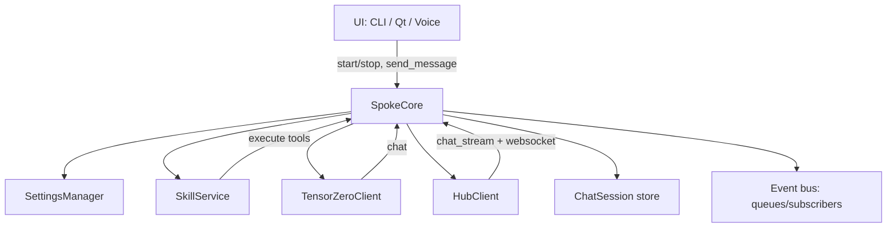

# SpokeCore Review (ai-pc-spoke/src/strawberry/spoke_core/app.py)

## Architecture Snapshot

**Read this as**: `SpokeCore` is both an orchestrator (lifecycle, settings, hub connection, skill loading), a state manager (sessions, mode), an event bus, and an agent runtime (hub + local agent loops).

## Review Items

- **[MAINTAINABILITY] SpokeCore is doing too many jobs (high coupling)**
  - **Type**: refactor / separation of concerns
  - **Checkbox**: [ ]
  - **Priority**: P1
  - **Difficulty**: L
  - **Files**:
    - `ai-pc-spoke/src/strawberry/spoke_core/app.py`
  - **Description**:
    - Currently mixes:
      - settings registration + settings change side-effects
      - skill loading and hub registration
      - session storage
      - agent loop logic (hub + local)
      - ~~event bus~~ ✅ Extracted to `event_bus.py`
      - deterministic test hooks based on parsing user input
    - Refactor direction (incremental, stability-first):
      - ~~Extract `EventBus` (subscribe/events/_emit) into a small class.~~ ✅ Done
      - ~~Extract `HubConnectionManager` (connect/disconnect/register/websocket task/reconnect scheduling).~~ ✅ Done → `hub_connection_manager.py`
      - ~~Extract `AgentRunner` with two implementations:~~ ✅ Done → `agent_runner.py`
        - ~~`HubAgentRunner` (forward messages, stream tool call events)~~
        - ~~`LocalAgentRunner` (tool loop, legacy code blocks)~~
      - Keep `SpokeCore` as an orchestrator facade that wires these. ✅

- **[MAINTAINABILITY] Deterministic “offline-only hooks” in send_message are fragile**
  - **Type**: refactor
  - **Checkbox**: [ ]
  - **Priority**: P2
  - **Difficulty**: M
  - **Files**:
    - `ai-pc-spoke/src/strawberry/spoke_core/app.py`
  - **Description**:
    - `send_message()` contains special parsing: if user text contains “use search_skills” or “python_exec must use … device.*(…)” it triggers immediate tool execution.
    - This couples product behavior to tests and makes behavior hard to reason about.
    - Refactor direction:
      - Move deterministic behavior behind a flag/config (e.g. `core.testing.deterministic_tool_hooks`) or a separate `DeterministicToolHook` injected only in tests.

- **[PERFORMANCE/UX] get_available_models performs synchronous network I/O**
  - **Type**: performance / UX
  - **Checkbox**: [ ]
  - **Priority**: P3
  - **Difficulty**: S
  - **Files**:
    - `ai-pc-spoke/src/strawberry/spoke_core/app.py`
  - **Description**:
    - `_get_available_models()` uses `httpx.get(...)` synchronously. If this is called from a UI thread it can freeze the UI.
    - Fix direction:
      - Cache results with TTL, or make it async and have settings UI fetch in background.

- **[API CLEANUP] SpokeCore relies on private members/methods**
  - **Type**: refactor
  - **Checkbox**: [ ]
  - **Priority**: P3
  - **Difficulty**: M
  - **Files**:
    - `ai-pc-spoke/src/strawberry/spoke_core/app.py`
  - **Description**:
    - `await self._llm._get_gateway()` (private method)
    - `env_storage = self._settings_manager._env_storage` (private attribute)
    - This makes upgrades and refactors brittle.
    - Fix direction:
      - Promote needed functionality to public APIs (e.g. `TensorZeroClient.start()` / `SettingsManager.set_secret(...)`).

## Suggested Target Design (Stability First)

- **Phase 1 (surgical)**:
  - Fix the P0 bugs (voice coroutine handling, send_message return contract).
  - Track/cancel Hub websocket task.
  - Make event bus robust to subscriber removal and shutdown.

- **Phase 2 (incremental extraction)**:
  - Extract `EventBus` and `HubConnectionManager`.
  - Extract `AgentRunner`.

- **Phase 3 (behavior cleanup)**:
  - Remove deterministic parsing hooks from production path.

